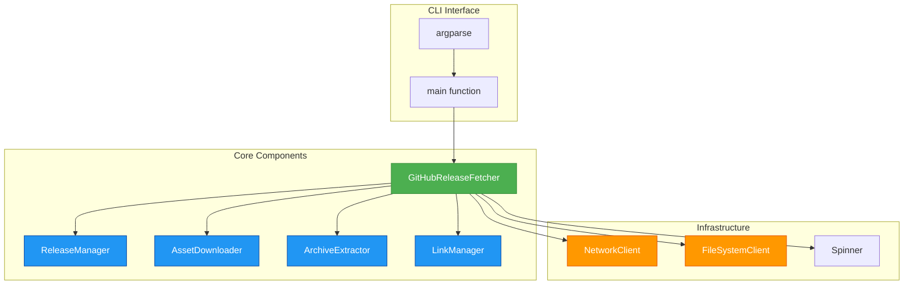
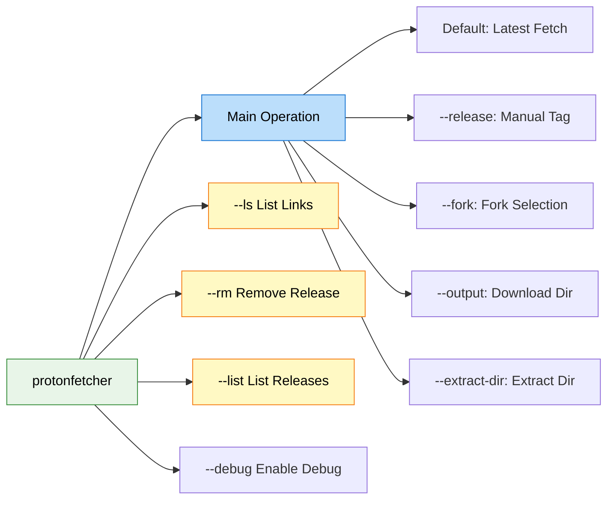
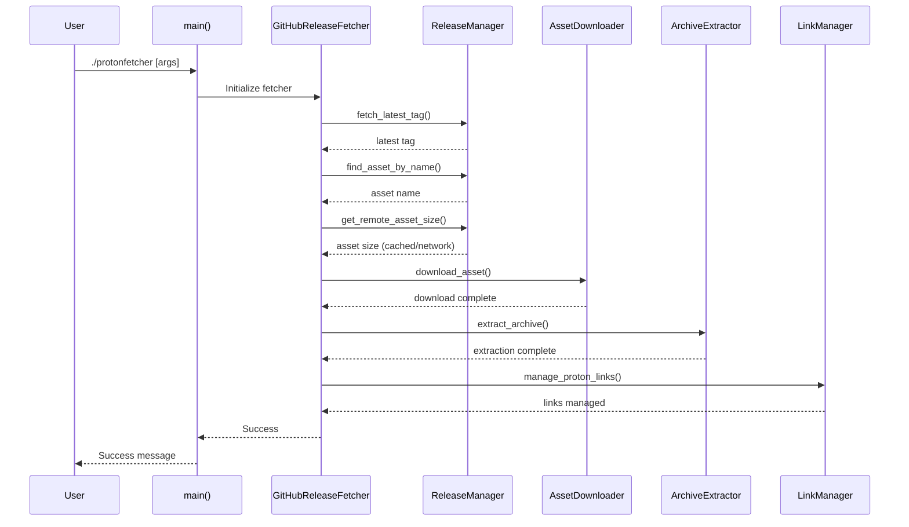
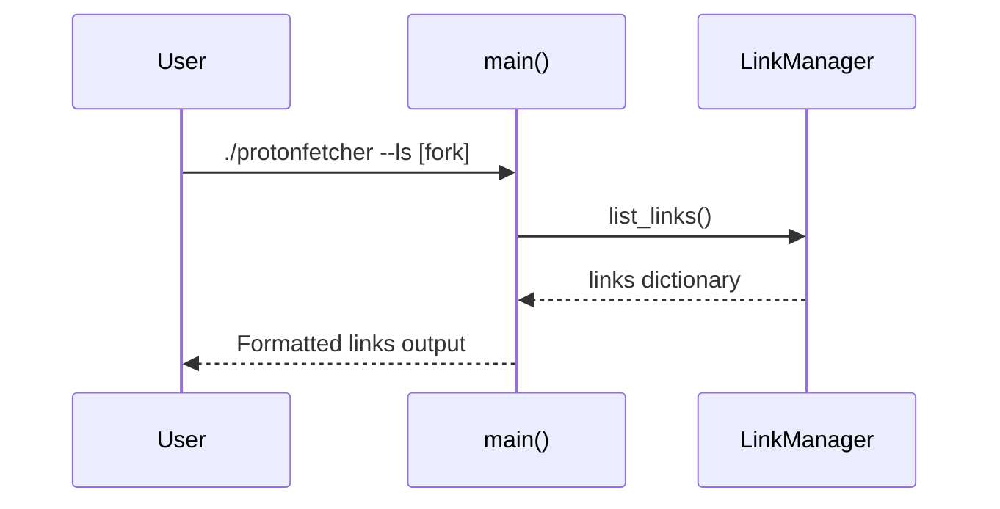
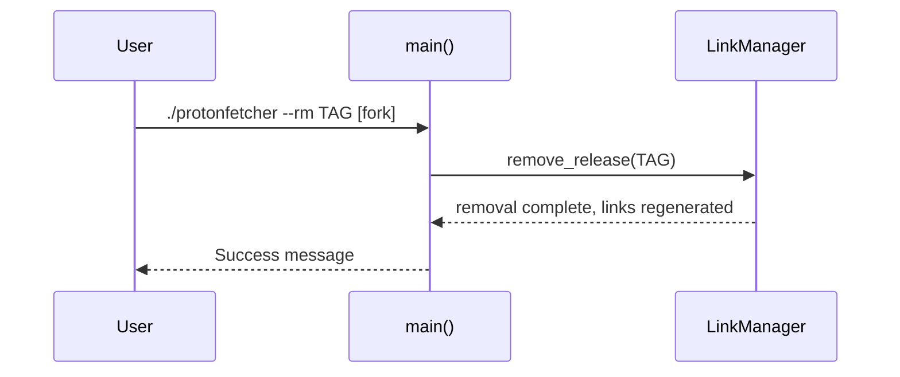

# ProtonFetcher Design Specification

## Overview

ProtonFetcher is a Python module designed to fetch and extract the latest ProtonGE GitHub release assets. It supports multiple Proton forks (GE-Proton and Proton-EM) and provides functionality to download, verify, extract, and manage symbolic links with progress indication.

## Architecture

The module follows a modular design with clear separation of concerns:



## Core Components

### GitHubReleaseFetcher

Main orchestrator that coordinates all operations through specialized managers:

- `fetch_and_extract`: Downloads and extracts releases
- `list_links`: Lists managed symbolic links
- `remove_release`: Removes specified releases and links

### ReleaseManager

Handles release discovery, asset finding, and size retrieval with intelligent caching to XDG cache directory.

### AssetDownloader

Manages downloads with progress indication and intelligent caching to avoid re-downloading matching files.

### ArchiveExtractor

Extracts archives with progress indication and format-specific methods (.tar.gz, .tar.xz).

### LinkManager

Manages symbolic links (GE-Proton, Proton-EM) ensuring links always point to newest versions.

## CLI Interface

The CLI provides comprehensive functionality through multiple flags:



### Main Operation Flow

Default operation (without --ls, --rm, --list) performs complete workflow:



### --ls Operation Flow

List operation to show managed symbolic links:



### --rm Operation Flow

Remove operation to delete specific release and update links:



## CLI Features and Options

- `--extract-dir`, `-x`: Directory to extract to (default: `~/.steam/steam/compatibilitytools.d/`)
- `--output`, `-o`: Directory to download to (default: `~/Downloads/`)
- `--release`, `-r`: Specify release tag instead of latest
- `--fork`, `-f`: Fork to download (GE-Proton, Proton-EM)
- `--list`, `-l`: List recent releases
- `--ls`: List managed links
- `--rm`: Remove specific release
- `--debug`: Enable debug logging

## Mutual Exclusion Constraints

The CLI enforces these constraints:

- `--ls` cannot be used with `--rm`, `--list`, or `--release`
- `--rm` cannot be used with `--ls`, `--list`, or `--release`
- `--list` cannot be used with `--release`
- `--debug` can be used with any operation

## Dependencies and Modern Features

- **Standard library**: argparse, dataclasses, hashlib, json, logging, os, re, shutil, subprocess, sys, tarfile, time, urllib, pathlib
- **System dependencies**: curl, tar
- **Modern Python 3.11+ features**:
  - `StrEnum` for fork safety
  - Built-in generics (dict, list, tuple)
  - `match/case` statements for control flow
  - `typing.Self` for fluent interfaces
  - Dataclasses for configuration objects
  - File-based caching with XDG directory

## Error Handling

Comprehensive error hierarchy:

- `ProtonFetcherError`: Base exception
- `NetworkError`: Network failures
- `ExtractionError`: Archive extraction failures
- `LinkManagementError`: Link management failures
- `MultiLinkManagementError`: Batch operation failures (ExceptionGroup)

## Testing Architecture

The testing strategy follows a comprehensive approach with different layers designed to verify various aspects of the system:

```mermaid
graph TD
    A[Test Suite] --> B[End-to-End Tests - test_e2e.py]
    A --> C[Integration Tests - test_integrations.py]
    A --> D[Unit Tests - test_units.py]

    B --> B1[CLI Interaction Tests]
    B --> B2[Full Workflow Simulations]
    B --> B3[Error Handling Tests]
    B --> B4[Feature Validation (--ls, --rm)]

    C --> C1[Component Integration]
    C --> C2[Link Management Integration]
    C --> C3[Download Workflow Integration]
    C --> C4[Extraction Workflow Integration]
    C --> C5[Complete Workflow Integration]

    D --> D1[Spinner Unit Tests]
    D --> D2[Utility Function Tests]
    D --> D3[Client Class Tests]
    D --> D4[Method-Specific Tests]
    D --> D5[Dependency Injection Tests]

    style A fill:#E1F5FE,stroke:#0277BD,stroke-width:2px
    style B fill:#FFF9C4,stroke:#F57F17,stroke-width:2px
    style C fill:#C8E6C9,stroke:#388E3C,stroke-width:2px
    style D fill:#BBDEFB,stroke:#1976D2,stroke-width:2px
    style B1 fill:#FFF3E0
    style B2 fill:#FFF3E0
    style B3 fill:#FFF3E0
    style B4 fill:#FFF3E0
    style C1 fill:#E8F5E8
    style C2 fill:#E8F5E8
    style C3 fill:#E8F5E8
    style C4 fill:#E8F5E8
    style C5 fill:#E8F5E8
    style D1 fill:#E3F2FD
    style D2 fill:#E3F2FD
    style D3 fill:#E3F2FD
    style D4 fill:#E3F2FD
    style D5 fill:#E3F2FD
```
