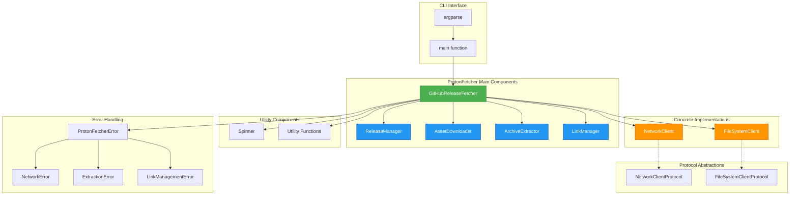
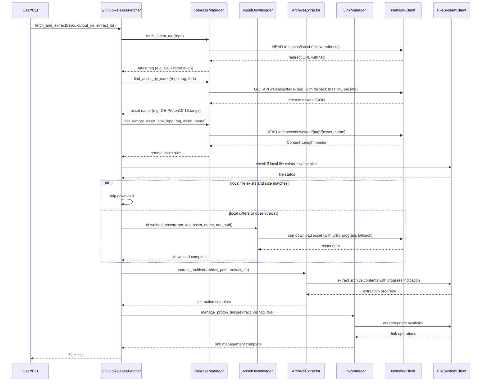

# ProtonFetcher Design Specification

## Overview

ProtonFetcher is a Python module designed to fetch and extract the latest ProtonGE GitHub release assets. It supports multiple Proton forks (primarily GE-Proton and Proton-EM) and provides functionality to download, verify, and extract these releases with progress indication.

## Architecture

The module follows a modular design with clear separation of concerns, organized into focused, single-responsibility classes. The design has been streamlined to reduce complexity and eliminate redundant wrapper methods:



The GitHubReleaseFetcher class serves as the main orchestrator, delegating specific responsibilities to specialized component classes:

- ReleaseManager handles release discovery and selection with direct network client access
- AssetDownloader manages asset downloads with caching and progress indication using direct network client calls
- ArchiveExtractor handles archive extraction with format-specific methods and streamlined logic
- LinkManager manages symbolic links with version sorting and cross-fork validation

## Components

### NetworkClient

Provides a concrete implementation of network operations using subprocess and urllib. It handles all HTTP requests through curl with proper timeout handling, header support, and error checking. The client supports GET requests, HEAD requests, and file downloads with appropriate error handling and response processing. It includes fallback mechanisms when headers are not provided and handles both redirect following and non-following scenarios.

### FileSystemClient

Provides a concrete implementation of file system operations using standard pathlib operations. It wraps common file system operations like checking existence, creating directories, reading/writing files, creating symbolic links, and removing files or directories. This abstraction allows for easier testing and potential future extensions. It handles both file and directory operations with proper error handling and validation.

### Spinner

Provides a simple native spinner progress indicator without external dependencies. It displays a customizable spinning character with optional progress bars, file details, and transfer rates. The spinner includes FPS limiting to prevent excessive terminal updates and clean terminal handling to avoid leftover characters. It supports both simple spinning indicators and detailed progress bars with percentage completion. Enhanced features include the ability to show file details during extraction and progress updates with explicit current/total values.

### ReleaseManager

Manages release discovery and selection operations. It handles fetching the latest release tags from GitHub by following redirects, finding specific assets within releases using both GitHub API and HTML parsing fallbacks, and retrieving remote asset sizes using HEAD requests. The manager uses direct network client calls instead of curl wrapper methods, implements robust error handling without redundant internal methods, and includes fallback mechanisms when the GitHub API fails. It gracefully handles rate limiting scenarios and supports listing recent releases from the GitHub API.

### AssetDownloader

Manages asset downloads with intelligent caching and progress indication. It handles downloading specific assets from GitHub releases with urllib-based progress indication and includes fallback to direct network client calls if urllib download fails. The downloader implements intelligent caching by comparing local file sizes with remote asset sizes to avoid unnecessary downloads. It includes proper header support for GitHub requests, uses direct network client access instead of curl wrapper methods, and handles various error conditions during download operations.

### ArchiveExtractor

Handles archive extraction operations with progress indication for both .tar.gz and .tar.xz formats. It supports multiple extraction methods including tarfile library with spinner-based progress indication and system tar command as fallback. The extractor includes specific functionality for both compressed formats, can determine archive format automatically, and has streamlined conditional logic for format detection. It provides detailed progress reporting during extraction with file-by-file updates and has reduced internal method complexity.

### LinkManager

Manages symbolic links for Proton installations with sophisticated version sorting and duplicate handling. It ensures that the three main symlinks always point to the three newest extracted versions regardless of download order. The manager includes functionality to list existing links, remove specific releases and their associated links, and handle both GE-Proton and Proton-EM fork formats with proper validation. It includes duplicate prevention and proper symlink target resolution.

### GitHubReleaseFetcher

The main orchestrator class that handles fetching and extracting GitHub release assets. It coordinates the network and file system operations through its component managers (ReleaseManager, AssetDownloader, ArchiveExtractor, LinkManager) to discover releases, identify appropriate assets, download them with progress indication, and extract them to target directories. The fetcher supports multiple Proton forks with different naming conventions and implements intelligent caching to avoid re-downloading files that already exist locally with matching sizes. It has reduced internal method complexity by removing redundant wrapper methods and focuses on essential public API methods (fetch_and_extract, list_links, remove_release) that can be called independently.

### Utility Functions

Helper functions for version parsing, asset naming, and formatting. These include parsing version tags for comparison, comparing version tags across different fork formats, generating expected asset names based on fork conventions, and formatting byte values into human-readable strings. Enhanced utility functions include version tuple creation and comprehensive parsing for both GE-Proton and Proton-EM formats.

## Data Flow

The following diagram illustrates the complete data flow through the system:



## Link Management System

ProtonFetcher implements a symbolic link management system to provide a consistent and predictable way to access Proton installations, regardless of the specific version directory name. This system creates a set of standardized symbolic links that point to the actual extracted Proton directory.

### Purpose

The link management system serves several key purposes:

- Provides stable, predictable paths for tools and scripts that need to reference the Proton installation
- Abstracts away version-specific directory names (e.g., `GE-Proton9-15`)
- Enables easy switching between Proton versions by updating links
- Supports fallback configurations for compatibility

### Link Structure

For each Proton fork, the system creates a standardized set of symbolic links in the extraction directory:

**For GE-Proton:**

- `GE-Proton` - Primary link to the latest installed version
- `GE-Proton-Fallback` - Secondary link for fallback configurations
- `GE-Proton-Fallback2` - Tertiary link for additional fallback options

**For Proton-EM:**

- `Proton-EM` - Primary link to the latest installed version
- `Proton-EM-Fallback` - Secondary link for fallback configurations
- `Proton-EM-Fallback2` - Tertiary link for additional fallback options

### Link Creation Process

The link management process is illustrated in the following diagram:

```mermaid
graph TD
    A[LinkManager] --> B[manage_proton_links]
    B --> C[find_version_candidates]
    C --> D[Parse version strings for each directory]
    D --> E[Compare versions using parse_version/compare_versions]
    E --> F[Sort directories by version (newest first)]

    F --> G[get_link_names_for_fork]
    G --> H[Create main symlinks (GE-Proton, Proton-EM)]
    G --> I[Create fallback symlinks (GE-Proton-Fallback, Proton-EM-Fallback)]
    G --> J[Create fallback2 symlinks (GE-Proton-Fallback2, Proton-EM-Fallback2)]

    H --> K[create_symlinks(top_3 versions)]
    I --> K
    J --> K

    K --> L[Remove old symlinks if they exist]
    L --> M[Create new symlinks pointing to top 3 versions]
    M --> N[Main -> newest version]
    M --> O[Fallback -> second newest]
    M --> P[Fallback2 -> third newest]

    A --> Q[list_links]
    Q --> R[Check if each symlink exists]
    R --> S[Resolve symlink targets]
    S --> T[Return dictionary mapping link names to targets]

    A --> U[remove_release]
    U --> V[Find release directory]
    V --> W[Check which symlinks point to this directory]
    W --> X[Remove release directory]
    X --> Y[Remove associated symlinks]
    Y --> Z[Regenerate link management system]

    style A fill:#4CAF50,stroke:#388E3C,color:#fff
    style B fill:#2196F3,stroke:#0D47A1,color:#fff
    style C fill:#2196F3,stroke:#0D47A1,color:#fff
    style K fill:#2196F3,stroke:#0D47A1,color:#fff
    style Q fill:#2196F3,stroke:#0D47A1,color:#fff
    style U fill:#2196F3,stroke:#0D47A1,color:#fff
    style H fill:#FFC107,stroke:#FF6F00,color:#000
    style I fill:#FFC107,stroke:#FF6F00,color:#000
    style J fill:#FFC107,stroke:#FF6F00,color:#000
```

### Link Management Workflow

1. **Directory Discovery**: After extracting an archive, the system identifies the actual Proton directory created during extraction. This directory typically has a version-specific name (e.g., `GE-Proton9-15` or `proton-EM-10.0-30`).

2. **Link Target Resolution**: The system resolves the absolute path to the discovered Proton directory to ensure links are absolute and not relative.

3. **Link Management**: The system removes any existing links with the same names to ensure clean updates, then creates new symbolic links pointing to the newly extracted directory.

4. **Validation**: The system validates that the links were created successfully and point to valid directories.

### Link Naming Convention

The link names are determined by the fork type and follow a consistent pattern:

- The primary link uses the fork name (e.g., `GE-Proton`)
- Fallback links append `-Fallback` and `-Fallback2` to the base name
- This convention ensures compatibility across different tools and scripts that expect these specific link names

### Integration with Extraction Process

The link management system is integrated into the extraction workflow:

- Links are created after successful archive extraction
- The system handles both manual and automatic release types
- For manual releases, the system searches for the correct directory within the extracted content
- The system uses the FileSystemClient for all link operations to maintain consistency

### Error Handling

The link management system includes robust error handling:

- Validates that the target directory exists before creating links
- Handles cases where links already exist by removing them first
- Provides clear error messages if link creation fails
- Ensures that the target directory is actually a directory, not a file

### Benefits

This link management system provides several benefits:

- **Consistency**: Tools can always reference `GE-Proton` regardless of the installed version
- **Flexibility**: Easy to update to new versions by simply updating the links
- **Compatibility**: Maintains compatibility with existing tools and scripts
- **Fallback Support**: Multiple links allow for fallback configurations
- **Clean Management**: Old versions can be removed without breaking the links

## Error Handling

The module implements a comprehensive error handling strategy with a hierarchy of custom exception types for specific failure cases. The base ProtonFetcherError serves as the parent exception, with NetworkError for network operations, ExtractionError for archive extraction failures, and LinkManagementError for symbolic link operations. It provides detailed error messages with context, implements graceful fallbacks (e.g., from urllib to direct network client calls, from tarfile to system tar), includes proper logging at appropriate levels, and validates inputs and preconditions. Redundant internal error wrapper methods have been removed to reduce complexity while maintaining the same error handling capabilities.

The system handles various error scenarios:

- Network timeouts and connection failures with appropriate retry mechanisms
- GitHub API rate limiting with user-friendly error messages
- Invalid or non-existent release directories for --rm operations
- Archive format mismatches with fallback extraction methods
- Permission errors during file system operations
- Broken symbolic links during link management operations

For the new `--ls` and `--rm` functionality:

- The `--ls` flag lists all known link names and their targets, showing "(not found)" for links that don't exist
- The `--rm` flag raises a LinkManagementError if the specified release directory does not exist
- Both flags follow the same error handling patterns as the rest of the module
- The link management system is automatically updated after removal to maintain consistency
- All CLI argument validation includes proper error handling and user feedback

## Dependencies

The module has minimal external dependencies, relying primarily on standard library modules including argparse, json, logging, re, shutil, subprocess, tarfile, time, urllib.parse, urllib.request, pathlib, and typing. It requires system dependencies of curl and tar for network operations and extraction. No third-party Python packages are required. Internal network operations now use direct network client access rather than redundant wrapper methods, reducing code complexity while maintaining the same functionality.

## Configuration

The module supports configuration through constants for default values (timeout, forks, etc.), command-line arguments (via argparse), fork-specific configurations in the FORKS dictionary, optional client injection for testing and customization, and timeout configuration for network operations.

## Enhanced Features

### Progress Indication

The module provides enhanced progress indication through the Spinner class with FPS limiting to prevent excessive terminal updates. It includes separate progress indication for download and extraction operations with detailed file information and transfer rates.

### Archive Format Support

Support for multiple archive formats (.tar.gz and .tar.xz) with automatic format detection and appropriate extraction methods. The system uses both the tarfile library with progress indication and system tar commands as fallbacks.

### Link Management System

Enhanced link management system that handles both GE-Proton and Proton-EM fork formats with proper validation to prevent cross-fork linking. The system includes duplicate prevention and preference for canonical naming conventions.

### CLI Enhancements

Enhanced command-line interface with additional flags:

- `--ls` flag for listing symbolic links and their targets
- `--rm` flag for removing specific releases and regenerating links
- Proper argument validation and mutual exclusion handling
- Support for all managed forks when using --ls without specifying a fork

## Usage Examples

### Basic Usage

Create a fetcher instance, get the latest release tag, find the appropriate asset, download it with progress indication, and extract it to a target directory.

### Using with Custom Clients

Create custom network and file system clients with specific configurations, then use them to initialize a fetcher with those custom clients.

### Using with Proton-EM Fork

Follow the same process as basic usage but specify "Proton-EM" as the fork type to handle the different naming conventions and archive formats used by that fork.

### Using --ls Flag (List Links)

Use the `--ls` flag to list recognized symbolic links and their associated Proton fork folders:

```bash
# List links for ALL managed forks (default behavior)
./protonfetcher --ls

# List links for specific fork only
./protonfetcher --ls -f Proton-EM

# List links with custom extract directory
./protonfetcher --ls --extract-dir ~/.steam/steam/compatibilitytools.d/
```

This will output the current state of symbolic links in the format:

```
Links for GE-Proton:
  GE-Proton -> /path/to/GE-Proton10-15
  GE-Proton-Fallback -> /path/to/GE-Proton10-12
  GE-Proton-Fallback2 -> (not found)
Success
```

### Using --rm Flag (Remove Release)

Use the `--rm` flag to remove a given Proton fork release folder and its associated links:

```bash
# Remove a specific GE-Proton release
./protonfetcher --rm GE-Proton10-15

# Remove a specific Proton-EM release
./protonfetcher --rm EM-10.0-30 -f Proton-EM

# Remove with custom extract directory
./protonfetcher --rm GE-Proton10-15 --extract-dir ~/.steam/steam/compatibilitytools.d/
```

This will:

1. Remove the specified release folder (e.g., `GE-Proton10-15`)
2. Remove any symbolic links that pointed to this release
3. Regenerate the link management system to maintain consistency
4. Output a success message or error if the directory doesn't exist

### Programmatic Usage

The GitHubReleaseFetcher class provides programmatic access to all functionality:

```python
from protonfetcher import GitHubReleaseFetcher

fetcher = GitHubReleaseFetcher()

# List links for a specific fork
links = fetcher.list_links(extract_dir, fork="GE-Proton")

# Remove a specific release
fetcher.remove_release(extract_dir, "GE-Proton10-15", fork="GE-Proton")

# Fetch and extract with progress indication
fetcher.fetch_and_extract(
    repo="GloriousEggroll/proton-ge-custom",
    output_dir=Path("~/Downloads").expanduser(),
    extract_dir=Path("~/.steam/steam/compatibilitytools.d").expanduser(),
    show_progress=True
)
```

### Command-Line Interface Options

Full list of command-line options:

- `--extract-dir`, `-x`: Directory to extract the asset to (default: `~/.steam/steam/compatibilitytools.d/`)
- `--output`, `-o`: Directory to download the asset to (default: `~/Downloads/`)
- `--release`, `-r`: Manually specify a release tag to download instead of the latest
- `--fork`, `-f`: ProtonGE fork to download (default: `GE-Proton`, available: `GE-Proton`, `Proton-EM`)
- `--list`, `-l`: List the 20 most recent release tags for the selected fork
- `--ls`: List recognized symbolic links and their associated Proton fork folders
- `--rm`: Remove a given Proton fork release folder and its associated link
- `--debug`: Enable debug logging

## Testing Architecture

The testing strategy follows a classic testing pyramid approach with different layers of tests designed to verify various aspects of the system. The `pytest` library and its plugin `pytest-mock` has a central role in our test suite implementation primarily for its `mocker`, `mocker.patch`, parametrization, and auto-mocking support:

```mermaid
graph TD
    A[Test Suite Structure] --> B[End-to-End Tests - test_e2e.py]
    A --> C[Integration Tests - test_integrations.py]
    A --> D[Unit Tests - test_units.py]

    B --> E[CLI Interaction Tests]
    B --> F[Full Workflow Simulations]
    B --> G[Error Handling Tests]

    C --> H[Link Management Integration]
    C --> I[Download Workflow Integration]
    C --> J[Extraction Workflow Integration]
    C --> K[Complete Workflow Tests]

    D --> L[Spinner Unit Tests]
    D --> M[Utility Function Tests]
    D --> N[Client Class Tests]
    D --> O[Method-Specific Tests]
    D --> P[Dependency Injection Tests]
    D --> Q[New Feature Tests (--ls, --rm)]

    style A fill:#E1F5FE,stroke:#0277BD,stroke-width:2px
    style B fill:#FFF9C4,stroke:#F57F17,stroke-width:2px
    style C fill:#C8E6C9,stroke:#388E3C,stroke-width:2px
    style D fill:#BBDEFB,stroke:#1976D2,stroke-width:2px
    style E fill:#FFF3E0
    style F fill:#FFF3E0
    style G fill:#FFF3E0
    style H fill:#E8F5E8
    style I fill:#E8F5E8
    style J fill:#E8F5E8
    style K fill:#E8F5E8
    style L fill:#E3F2FD
    style M fill:#E3F2FD
    style N fill:#E3F2FD
    style O fill:#E3F2FD
    style P fill:#E3F2FD
    style Q fill:#E3F2FD
```

### Test Categories

#### Unit Tests (`test_units.py`)

- Test individual functions and methods in isolation
- Focus on utility functions (parse_version, compare_versions, etc.)
- Test Spinner class methods and functionality with progress indication
- Test client implementations (NetworkClient, FileSystemClient)
- Test error handling paths and edge cases
- Test dependency injection functionality
- Test ReleaseManager operations including API fallbacks
- Test AssetDownloader with caching and progress indication
- Test ArchiveExtractor with multiple archive formats
- Test LinkManager with version sorting and link operations
- Test new --ls and --rm functionality in isolation

#### Integration Tests (`test_integrations.py`)

- Test workflows that involve multiple components working together
- Test link management system workflows
- Test download and extraction workflows with progress indication
- Test complete fetch_and_extract workflows
- Test API fallback behavior (API -> HTML parsing)
- Test the full workflow with mocked dependencies
- Test cross-component error handling and fallbacks
- Test enhanced link management with duplicate prevention
- Test archive extraction with both tarfile and system tar methods

#### End-to-End Tests (`test_e2e.py`)

- Test actual CLI interactions and command execution
- Test full user workflows from command to completion
- Test different fork and release combinations
- Test error handling at the CLI level
- Test the new --ls and --rm functionality in real scenarios
- Test argument validation and parsing
- Test mutual exclusion of CLI flags
- Test enhanced progress indication during real operations
- Test cross-fork link validation and management

### Test Design Patterns

The test suite follows several important design patterns:

1. **Fixture-based Testing**: Using pytest fixtures for common test dependencies like mock objects, temporary directories, and test constants
2. **Parametrized Testing**: Using pytest parametrization to test multiple scenarios with different inputs
3. **Mock-based Testing**: Leveraging pytest-mock for dependency isolation
4. **Behavior-driven Testing**: Testing workflows and expected behaviors rather than just individual functions
5. **Error Path Testing**: Testing error conditions and exception handling paths

### Testing Architecture and Methodology

The test suite employs a multi-layered testing approach that ensures comprehensive coverage:

#### Unit Test Architecture

Unit tests in `test_units.py` focus on individual components and functions with the following characteristics:

- **Granular Coverage**: Each function and class method has dedicated tests verifying specific behaviors
- **Isolation**: Dependencies are mocked to ensure tests only verify the unit under test
- **Fast Execution**: Tests are fast-running to support rapid development cycles
- **Edge Case Handling**: Comprehensive testing of error conditions and boundary values

The unit tests cover:

- Utility functions with parametrized inputs for multiple scenarios
- All client methods with proper error handling verification
- Component-specific functionality with isolated behavior testing
- Error propagation mechanisms to ensure proper exception handling

#### Integration Test Architecture

Integration tests in `test_integrations.py` focus on multi-component workflows with the following characteristics:

- **Component Interaction**: Tests verify that multiple components work together correctly
- **Workflow Validation**: Complete workflows are tested to ensure system-level functionality
- **Cross-Component Dependencies**: Interactions between components are verified
- **API Fallback Testing**: Verify fallback mechanisms work correctly when primary methods fail

The integration tests cover:

- Link management system workflows that involve multiple components
- Download and extraction workflows with real file system operations
- API fallback scenarios where the system gracefully handles failures
- Complete fetch_and_extract workflows with all components working together

#### End-to-End Test Architecture

End-to-end tests in `test_e2e.py` simulate real user interactions with the following characteristics:

- **CLI Testing**: Actual command-line interface interactions are simulated
- **User Workflow Simulation**: Complete user journeys are tested from start to finish
- **Realistic Scenarios**: Tests represent real-world usage patterns
- **Error Handling**: Verify that error conditions are properly handled and communicated to users

### Mocking and Dependency Injection Patterns

The test suite extensively uses mocking and dependency injection to create controlled test environments:

#### Mock-Based Testing Patterns

- **Dependency Isolation**: External dependencies like network calls and file system operations are mocked to ensure test reliability
- **Behavior Verification**: Tests verify that components interact correctly with their dependencies
- **Error Simulation**: Mocks allow simulation of error conditions and network failures
- **State Verification**: Tests can verify that components make the correct calls to their dependencies

#### Client Mocking

The test suite uses the client pattern extensively where components are initialized with mock clients during testing:

```python
# Example of dependency injection in tests
mock_network = mocker.Mock()
mock_fs = mocker.Mock()
fetcher = GitHubReleaseFetcher(network_client=mock_network, file_system_client=mock_fs)
```

This pattern allows tests to:

- Control the behavior of all external dependencies
- Verify specific method calls and parameters
- Simulate different response scenarios
- Test error handling without external dependencies

#### Pytest Fixtures and Parametrization

The test suite makes extensive use of pytest features:

- **Fixtures**: Reusable test setup for common objects, temporary directories, and configuration
- **Parametrization**: Testing multiple inputs with the same test logic to reduce code duplication
- **Auto-mocking**: Using `pytest-mock` for convenient mock creation and cleanup

### Test Coverage Strategy

The test suite aims for comprehensive coverage with a focus on:

#### Functional Coverage

- All public API methods are tested
- Critical paths are thoroughly validated
- Error handling is comprehensively tested
- Edge cases are verified

#### Fork-Specific Testing

- Both GE-Proton and Proton-EM forks are tested
- Fork-specific behaviors and differences are validated
- Cross-fork functionality is verified
- Format-specific handling is tested

#### Progress and UX Testing

- Progress indication functionality is validated
- User experience elements are tested
- CLI interactions are verified
- Output formatting is checked

### Testing Methodology

The testing methodology follows these principles:

#### Test Drivers

- Each test has a clear, specific purpose
- Tests verify expected behaviors and outcomes
- Error conditions are explicitly tested
- Success and failure paths are both verified

#### Behavior Testing

- Tests verify component behavior rather than implementation details
- API contracts are validated
- Integration points are thoroughly tested
- Error propagation is verified

#### Maintenance and Scalability

- Tests are designed to be maintainable as the codebase evolves
- Parametrized tests reduce maintenance overhead
- Clear test names and organization improve maintainability
- Test independence allows parallel execution

## Future Considerations

Potential enhancements include implementing checksum verification for downloaded files, extending support for additional Proton forks, adding support for configuration files to store preferences, providing hooks for GUI integration, implementing support for delta updates to reduce download sizes, adding functionality to fetch and display release notes, implementing more sophisticated caching mechanisms with automatic cleanup of old versions, adding support for parallel downloads of multiple assets, and implementing a plugin system for custom extraction handlers.

## Security Considerations

Security measures include input validation for all inputs, protection against path traversal attacks in extraction, use of HTTPS for all network requests, size verification of downloaded content, and safe handling of symbolic links during extraction.

## Performance Considerations

Performance optimizations include streaming downloads of large files in chunks with progress indication, use of appropriate extraction methods for different archive formats, intelligent caching to skip re-downloading files that match remote size, FPS limiting for progress indication to prevent excessive terminal updates, memory management through processing files in chunks to minimize memory usage, and reduced method call overhead through elimination of redundant wrapper methods.
