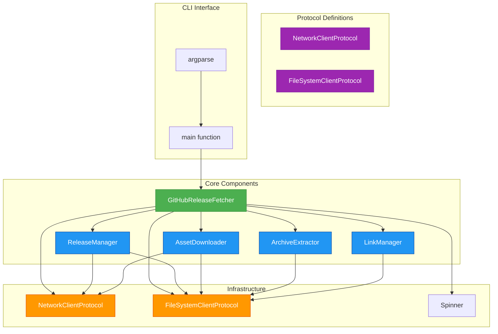
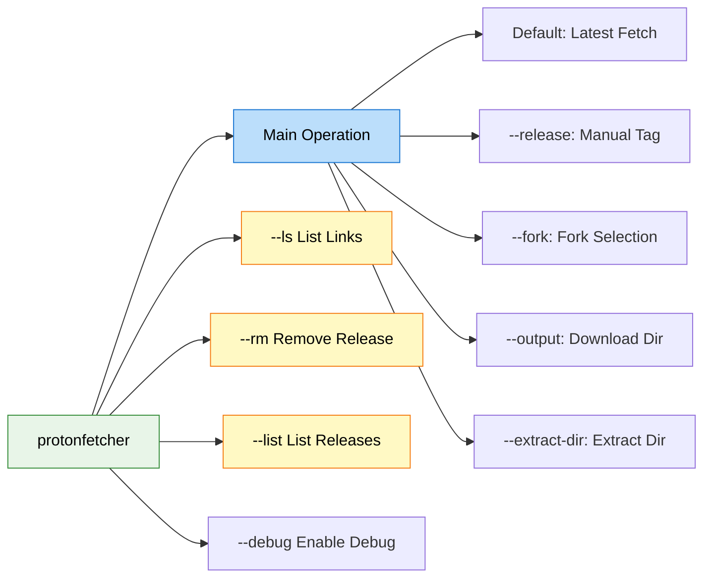
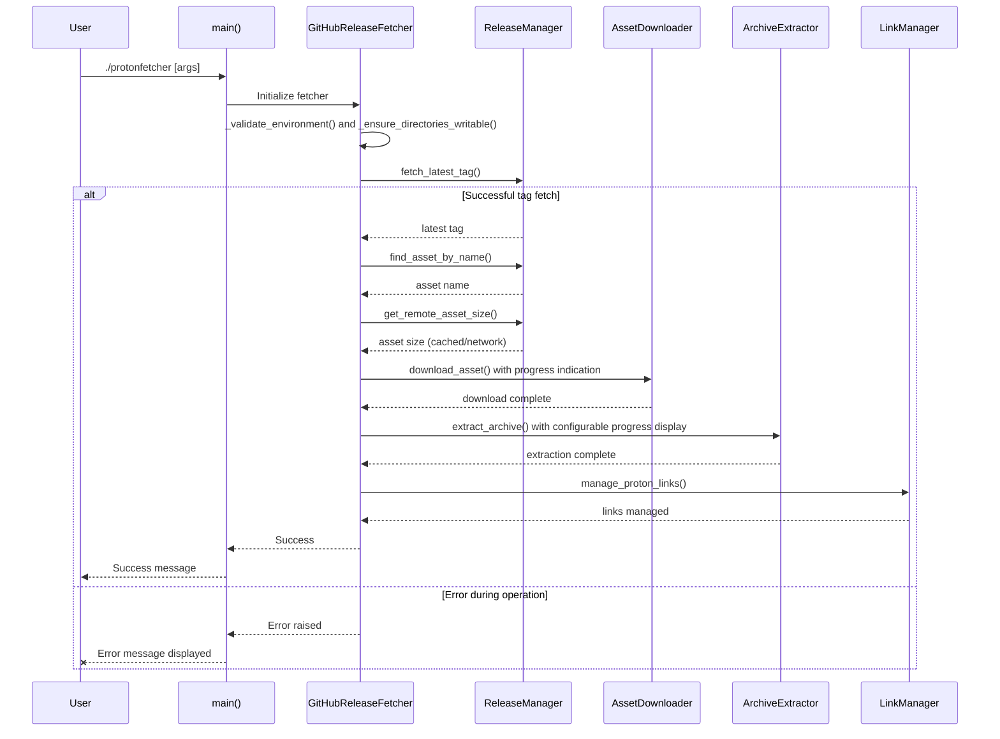
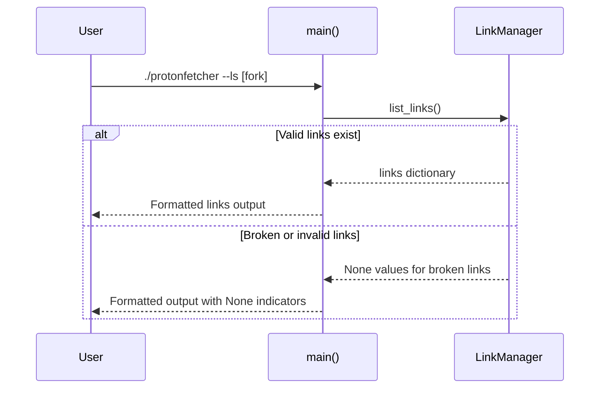
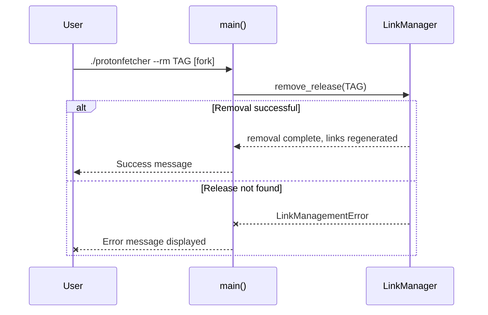
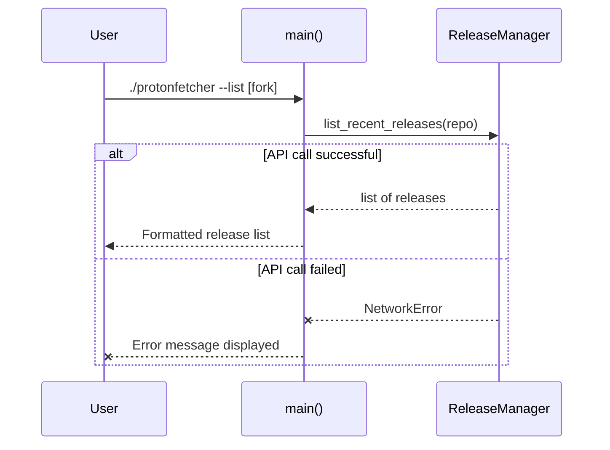

# ProtonFetcher Design Specification

## Overview

ProtonFetcher is a Python module designed to fetch and extract the latest ProtonGE GitHub release assets. It supports multiple Proton forks (GE-Proton and Proton-EM) and provides functionality to download, verify, extract, and manage symbolic links with progress indication.

## Architecture

The module follows a modular design with clear separation of concerns and dependency injection:



The architecture uses Protocol-based dependency injection to enable easy testing and component substitution. The NetworkClientProtocol and FileSystemClientProtocol define the interfaces that can be implemented by concrete classes or mocked for testing. The GitHubReleaseFetcher serves as the main orchestrator that instantiates and coordinates the specialized managers (ReleaseManager, AssetDownloader, ArchiveExtractor, LinkManager) rather than directly implementing all functionality.

The current implementation includes enhanced error validation and system tool availability checks, with the GitHubReleaseFetcher performing `_validate_environment` to ensure required tools like curl are available before operations proceed. The infrastructure components (NetworkClient, FileSystemClient) provide concrete implementations of the protocols, while the Spinner provides configurable progress indication with FPS limiting.

## Core Components

### GitHubReleaseFetcher

Main orchestrator that coordinates all operations through specialized managers and dependency injection:

- `fetch_and_extract`: Downloads and extracts releases with progress indication
- `list_links`: Lists managed symbolic links for a specified fork
- `remove_release`: Removes specified releases and their associated links
- `list_recent_releases`: Lists available releases for selection
- `_ensure_directory_is_writable`: Ensures directories exist and are writable
- `_validate_environment`: Validates required tools like curl are available
- `_ensure_directories_writable`: Validates output and extract directories
- `_determine_release_tag`: Determines release tag to use (latest or manual)
- `_download_asset`: Downloads the specified asset
- `_extract_and_manage_links`: Extracts archive and manages symbolic links
- `_get_expected_directories`: Gets expected unpack directories based on fork type
- `_check_existing_directory`: Checks if unpacked directory already exists
- `_handle_existing_directory`: Handles case where directory already exists
- `_check_post_download_directory`: Checks if unpacked directory exists after download
- `_extract_and_manage_links`: Extracts archive and manages symbolic links

The component uses dependency injection to accept NetworkClientProtocol and FileSystemClientProtocol implementations, enabling easy testing with mock objects. It instantiates the specialized managers (ReleaseManager, AssetDownloader, ArchiveExtractor, LinkManager) during initialization rather than implementing all functionality directly. The fetch_and_extract method supports configurable progress indication through show_progress and show_file_details parameters.

### ReleaseManager

Handles release discovery, asset finding, and size retrieval with intelligent caching to XDG cache directory:

- `fetch_latest_tag`: Gets latest release tag from GitHub using redirects
- `find_asset_by_name`: Finds asset files by name with GitHub API fallback
- `get_remote_asset_size`: Retrieves asset size using HEAD requests with redirect handling
- `list_recent_releases`: Fetches list of recent releases from GitHub API
- `_get_cache_key`: Generates cache key for the given asset
- `_get_cache_path`: Gets the cache file path for a given key
- `_is_cache_valid`: Checks if cached data is still valid (not expired)
- `_get_cached_asset_size`: Gets cached asset size if available and not expired
- `_cache_asset_size`: Caches the asset size
- `_try_api_approach`: Attempts to find asset using GitHub API
- `_try_html_fallback`: Falls back to HTML parsing if API fails
- `_get_expected_extension`: Gets the expected archive extension based on the fork
- `_find_matching_assets`: Finds assets that match the expected extension
- `_handle_api_response`: Handles the API response to find the appropriate asset
- `_check_for_error_in_response`: Checks if the response contains an error
- `_extract_size_from_response`: Extracts content-length from response headers
- `_follow_redirect_and_get_size`: Follows redirect and attempts to get content size
- Intelligent caching system with XDG cache directory support
- Redirect chain handling for GitHub releases with multiple redirects

### AssetDownloader

Manages downloads with progress indication and intelligent caching to avoid re-downloading matching files:

- `download_asset`: Downloads asset with progress indication and caching
- `curl_get`: Makes GET requests using curl
- `curl_head`: Makes HEAD requests using curl
- `curl_download`: Downloads files using curl
- `download_with_spinner`: Downloads file with progress spinner using urllib
- `_check_existing_file`: Checks if local file already exists and has matching size
- Intelligent cache validation and reuse to minimize bandwidth usage
- Fallback mechanism from spinner-based download to curl if urllib fails
- Integration with ReleaseManager for size comparison

### ArchiveExtractor

Extracts archives with progress indication and format-specific methods (.tar.gz, .tar.xz):

- `extract_archive`: Main extraction method with format detection and fallbacks
- `extract_with_tarfile`: Uses Python's tarfile library with progress indication
- `extract_gz_archive`: Specialized method for .tar.gz files using system tar
- `extract_xz_archive`: Specialized method for .tar.xz files using system tar
- `get_archive_info`: Retrieves archive metadata without full extraction
- `is_tar_file`: Checks if file is a tar file
- `_extract_with_system_tar`: Extracts archive using system tar command
- `show_progress` and `show_file_details` parameters for configurable progress display
- System tar fallback mechanism for enhanced compatibility
- Spinner-based progress indication with detailed file information display
- Format-specific extraction methods for different archive types
- Error handling for truncated or corrupted archives
- Configurable FPS limiting to prevent excessive terminal updates
- Support for both progress bar and spinner-only modes
- Configurable file detail display during extraction with show_file_details parameter

### LinkManager

Manages symbolic links (GE-Proton, Proton-EM) ensuring links always point to newest versions:

- `create_symlinks`: Creates managed symbolic links with priority ordering
- `list_links`: Lists existing managed links with target information
- `remove_release`: Removes specified releases and updates links
- `find_version_candidates`: Identifies Proton versions for sorting and linking
- `get_link_names_for_fork`: Gets the symlink names for a specific fork
- `find_tag_directory`: Finds the tag directory for manual releases
- `manage_proton_links`: Ensures symlinks point to the newest versions
- `_determine_release_path`: Determines the correct release path for Proton-EM format
- `_check_release_exists`: Checks if the release directory exists
- `_identify_links_to_remove`: Identifies symbolic links that point to the release directory
- `_remove_release_directory`: Removes the release directory
- `_remove_symbolic_links`: Removes the associated symbolic links
- `_get_tag_name`: Gets the tag name from directory entry, handling Proton-EM prefix
- `_should_skip_directory`: Checks if directory should be skipped based on fork
- `_is_valid_proton_directory`: Validates directory name matches expected pattern
- `_create_symlink_specs`: Creates SymlinkSpec objects for the top 3 versions
- `_cleanup_unwanted_links`: Removes unwanted symlinks and conflicting directories
- `_compare_targets`: Compares if two targets are the same by checking resolved paths
- `_handle_existing_symlink`: Handles existing symlink to check if it points to correct target
- `_cleanup_existing_path_before_symlink`: Cleans up existing path before creating symlink
- `_deduplicate_candidates`: Removes duplicate versions, preferring standard naming
- `_handle_manual_release_candidates`: Handles candidates for manual releases
- `_handle_regular_release_candidates`: Handles candidates for regular releases
- `_get_link_names`: Gets the symlink names for the fork
- `_handle_manual_release_directory`: Handles manual release by finding tag directory
- `_check_post_download_directory`: Checks if unpacked directory exists after download
- `_determine_release_path`: Determines the correct release path for Proton-EM format
- `_check_release_exists`: Checks if the release directory exists
- `_identify_links_to_remove`: Identifies symbolic links that point to the release directory
- `_remove_release_directory`: Removes the release directory
- `_remove_symbolic_links`: Removes the associated symbolic links
- `_get_tag_name`: Gets the tag name from directory entry, handling Proton-EM prefix
- `_should_skip_directory`: Checks if directory should be skipped based on fork
- `_is_valid_proton_directory`: Validates directory name matches expected pattern
- `_create_symlink_specs`: Creates SymlinkSpec objects for the top 3 versions
- `_cleanup_unwanted_links`: Removes unwanted symlinks and conflicting directories
- Advanced conflict resolution for directory/link name conflicts
- Broken symlink handling and validation
- Proton-EM naming convention support with flexible prefix handling

## CLI Interface

The CLI provides comprehensive functionality through multiple flags with extensive validation and error handling:



### CLI Features and Options

- `--extract-dir`, `-x`: Directory to extract to (default: `~/.steam/steam/compatibilitytools.d/`)
- `--output`, `-o`: Directory to download to (default: `~/Downloads/`)
- `--release`, `-r`: Specify release tag instead of latest
- `--fork`, `-f`: Fork to download (GE-Proton, Proton-EM)
- `--list`, `-l`: List recent releases
- `--ls`: List managed links
- `--rm`: Remove specific release
- `--debug`: Enable debug logging

### Argument Validation and Mutual Exclusion

The CLI enforces comprehensive argument validation with these constraints:

- `--ls` cannot be used with `--rm`, `--list`, or `--release`
- `--rm` cannot be used with `--ls`, `--list`, or `--release`
- `--list` cannot be used with `--release`
- `--debug` can be used with any operation
- All mutually exclusive flags trigger clear error messages and exit with code 1
- Invalid fork names and malformed arguments are detected and handled gracefully
- Path validation for output and extract directories
- Directory creation and write permission validation
- Fork validation using ForkName enum choices
- Additional validation: `--ls` and `--rm` cannot be used with other conflicting flags including each other
- Enhanced mutual exclusion validation between `--ls`, `--rm`, `--list`, and `--release` flags
- Validation implemented via `_validate_mutually_exclusive_args` function

### Main Operation Flow

Default operation (without --ls, --rm, --list) performs complete workflow with comprehensive error handling and validation:



### --ls Operation Flow

List operation to show managed symbolic links with error handling for broken symlinks:



### --rm Operation Flow

Remove operation to delete specific release and update links with validation and error handling:



### --list Operation Flow

List operation to fetch and display recent releases with API error handling:



## CLI Features and Options

- `--extract-dir`, `-x`: Directory to extract to (default: `~/.steam/steam/compatibilitytools.d/`)
- `--output`, `-o`: Directory to download to (default: `~/Downloads/`)
- `--release`, `-r`: Specify release tag instead of latest
- `--fork`, `-f`: Fork to download (GE-Proton, Proton-EM)
- `--list`, `-l`: List recent releases
- `--ls`: List managed links
- `--rm`: Remove specific release
- `--debug`: Enable debug logging

## Mutual Exclusion Constraints

The CLI enforces comprehensive argument validation with these constraints:

- `--ls` cannot be used with `--rm`, `--list`, or `--release`
- `--rm` cannot be used with `--ls`, `--list`, or `--release`
- `--list` cannot be used with `--release`
- `--debug` can be used with any operation
- All mutually exclusive flags trigger clear error messages and exit with code 1
- Advanced validation includes fork selection constraints and path validation
- Invalid fork names and malformed arguments are detected and handled gracefully

## Dependencies and Modern Features

- **Standard library**: argparse, dataclasses, hashlib, json, logging, os, re, shutil, subprocess, sys, tarfile, time, urllib, pathlib, enum
- **System dependencies**: curl, tar
- **Modern Python 3.11+ features**:
  - `StrEnum` for fork safety with ForkName enum
  - Built-in generics (dict, list, tuple)
  - `match/case` statements for control flow
  - `typing.Self` for fluent interfaces
  - Dataclasses for configuration objects (ForkConfig)
  - File-based caching with XDG directory
  - Protocol-based dependency injection for testing
  - ExceptionGroup for batch operation errors
  - Type checking with pyright
  - Protocol classes for client interfaces
  - Enhanced error handling with structured exceptions
  - Environment validation via `_validate_environment` to ensure required tools like curl are available
  - Configurable progress indication with show_progress and show_file_details parameters
  - FPS limiting for terminal refresh rates to prevent excessive updates

## Fork Configuration System

The application supports multiple Proton forks through a structured configuration system:

- `ForkName`: StrEnum containing `GE_PROTON` and `PROTON_EM`
- `ForkConfig`: Dataclass containing repository and archive format for each fork
- `FORKS`: Dictionary mapping ForkName enum values to ForkConfig objects
- `DEFAULT_FORK`: Specifies the default fork (GE-Proton)
- Asset naming follows different patterns per fork: GE-Proton uses format like `GE-Proton10-20.tar.gz`, Proton-EM uses format like `proton-EM-10.0-30.tar.xz`
- Version parsing logic accounts for different naming conventions in each fork
- Link management creates appropriate symlink names based on fork: `GE-Proton`, `GE-Proton-Fallback`, `GE-Proton-Fallback2` for GE-Proton and `Proton-EM`, `Proton-EM-Fallback`, `Proton-EM-Fallback2` for Proton-EM
- Directory naming conventions differ between forks for extracted archives
- `get_proton_asset_name` function generates appropriate asset names for each fork based on tag and fork type

## Error Handling

Comprehensive error hierarchy with extensive error handling and validation:

- `ProtonFetcherError`: Base exception for all ProtonFetcher errors (alias: `FetchError` for backward compatibility)
- `NetworkError`: Network failures including connection errors, timeouts, HTTP errors, and invalid responses
- `ExtractionError`: Archive extraction failures including corrupt archives, invalid formats, system command failures, and permission issues
- `LinkManagementError`: Link management failures including invalid paths, permission issues, and conflict resolution failures
- `MultiLinkManagementError`: Batch operation failures (ExceptionGroup) for multiple link operations
- `ProtonFetcherError` serves as the base class for all custom exceptions
- Extensive validation for CLI argument validation including mutually exclusive flag constraints
- Comprehensive network client error handling with subprocess error management and timeout propagation
- Robust cache management with file corruption handling and validation
- Detailed symlink management with broken symlink detection and directory conflict resolution
- Advanced archive extraction error handling with fallback mechanisms and truncated archive detection
- Proper error propagation throughout the call stack ensuring clear error messages
- Validation of required system tools like curl during initialization via `_validate_environment`
- Directory creation and write permission validation before operations
- API rate limit error handling with appropriate user feedback
- Enhanced error handling for directory validation and write permissions through `_ensure_directory_is_writable`
- Validation methods to ensure required system tools are available before operations

## Testing Architecture

The testing strategy follows a comprehensive approach with different layers designed to verify various aspects of the system. The test suite is organized across multiple modules with shared fixtures in `conftest.py`:

```mermaid
graph TD
    A[Test Suite] --> B[Unit Tests]
    A --> C[Integration Tests]
    A --> D[CLI Tests]
    A --> E[Quality Assurance Tests]

    B --> B1[Utility Functions - test_utils.py]
    B --> B2[Spinner Class - test_spinner.py]
    B --> B3[Network Client - test_network_client.py]
    B --> B4[File System Client - test_filesystem_client.py]
    B --> B5[Release Manager - test_release_manager.py]
    B --> B6[Asset Downloader - test_asset_downloader.py]
    B --> B7[Archive Extractor - test_archive_extractor.py]
    B --> B8[Link Manager - test_link_manager.py]
    B --> B9[GitHub Release Fetcher - test_github_release_fetcher.py]

    C --> C1[Download Workflow - test_download_workflow.py]
    C --> C2[Extraction Workflow - test_extraction_workflow.py]
    C --> C3[Link Management Workflow - test_link_management_workflow.py]
    C --> C4[Complete Workflow - test_complete_workflow.py]

    D --> D1[CLI Core - test_cli.py]
    D --> D2[CLI Flags - test_cli_flags.py]
    D --> D3[CLI Error Handling - test_cli_error_handling.py]

    E --> E1[Complexity Regression Tests - test_complexity_regression.py]

    style A fill:#E1F5FE,stroke:#0277BD,stroke-width:2px
    style B fill:#C8E6C9,stroke:#388E3C,stroke-width:2px
    style C fill:#BBDEFB,stroke:#1976D2,stroke-width:2px
    style D fill:#FFF9C4,stroke:#F57F17,stroke-width:2px
    style E fill:#E0E0E0,stroke:#616161,stroke-width:2px
    style B1 fill:#E8F5E8
    style B2 fill:#E8F5E8
    style B3 fill:#E8F5E8
    style B4 fill:#E8F5E8
    style B5 fill:#E8F5E8
    style B6 fill:#E8F5E8
    style B7 fill:#E8F5E8
    style B8 fill:#E8F5E8
    style B9 fill:#E8F5E8
    style C1 fill:#E3F2FD
    style C2 fill:#E3F2FD
    style C3 fill:#E3F2FD
    style C4 fill:#E3F2FD
    style D1 fill:#FFF3E0
    style D2 fill:#FFF3E0
    style D3 fill:#FFF3E0
    style E1 fill:#EEEEEE
```



The test suite includes comprehensive coverage across different testing levels:

- **Unit Tests**: Component-specific tests in dedicated modules with focused responsibility
- **Integration Tests**: Workflow-oriented tests verifying multiple components work together
- **CLI Tests**: Comprehensive validation of command-line interface functionality and error handling, separated across specialized modules (test_cli.py, test_cli_flags.py, test_cli_validation.py, test_cli_error_handling.py)
- **Quality Assurance Tests**: Automated checks for code complexity metrics and maintainability
- **Parametrized Tests**: Comprehensive fork-specific testing using `@pytest.mark.parametrize`
- **Mock-based Testing**: Protocol-based dependency injection enables comprehensive testing with mock clients
- **Shared Fixtures**: Centralized fixtures in `conftest.py` provide consistent test environments
- **Error Scenario Testing**: Extensive validation of all error conditions and exception handling, consolidated in test_errors.py
- **Comprehensive Coverage**: Tests for both GE-Proton and Proton-EM forks across all components
- **Consistent Approach**: Standardized testing patterns across all modules for maintainability
- **Workflow Tests**: Specialized modules for different workflow types (test_download_workflow.py, test_extraction_workflow.py, test_link_management_workflow.py, test_complete_workflow.py)
- **Additional Test Types**: Specialized modules for network client testing, filesystem client testing, release manager cache validation, spinner functionality, and fork-specific configuration validation

### Unit Test Coverage by Component

The test suite provides comprehensive unit test coverage for each core component:

1. **GitHubReleaseFetcher Unit Tests** (`test_github_release_fetcher.py`, `test_github_release_fetcher_methods.py`, `test_github_release_fetcher_validation.py`):
   - `fetch_and_extract` method with successful workflow and all error scenarios
   - `list_links`, `remove_release`, `list_recent_releases` methods
   - `_ensure_directory_is_writable`, `_determine_release_tag` helper methods
   - Network error handling, extraction errors, and link management errors
   - Complete workflow validation with mocked dependencies
   - Validation and method-specific testing in separate modules

2. **ReleaseManager Unit Tests** (`test_release_manager.py`, `test_release_manager_cache.py`):
   - `fetch_latest_tag` with redirect handling and error conditions
   - `find_asset_by_name` with GitHub API and HTML fallback approaches
   - `get_remote_asset_size` with caching and network validation
   - `list_recent_releases` with API call validation
   - Cache management with validation of XDG cache directory behavior
   - Caching validation including TTL, key generation, and cache invalidation
   - Specialized cache validation in separate module

3. **AssetDownloader Unit Tests** (`test_asset_downloader.py`, `test_asset_downloader_methods.py`):
   - `download_asset` with progress indication and caching validation
   - `curl_get`, `curl_head`, `curl_download` functionality
   - `download_with_spinner` with urllib fallback mechanisms
   - Intelligent cache validation and reuse scenarios
   - Error handling for download failures and network timeouts
   - Method-specific testing in separate modules

4. **ArchiveExtractor Unit Tests** (`test_archive_extractor.py`):
   - `extract_archive` with automatic format detection
   - `extract_with_tarfile`, `extract_gz_archive`, `extract_xz_archive` methods
   - `_extract_with_system_tar` fallback functionality
   - `get_archive_info` and `is_tar_file` validation
   - Format-specific extraction validation

5. **LinkManager Unit Tests** (`test_link_manager.py`):
   - `create_symlinks`, `list_links`, `remove_release` methods
   - `manage_proton_links` with version sorting and link management
   - `find_version_candidates` for directory discovery
   - Error handling for link management scenarios

6. **Spinner Unit Tests** (`test_spinner.py`, `test_spinner_functionality.py`, `test_spinner_iteration.py`):
   - Progress indication with FPS limiting
   - File detail display during extraction
   - Format-specific spinner behavior
   - Iteration-based progress updates

7. **NetworkClient Unit Tests** (`test_network_client.py`):
   - `get`, `head`, `download` methods with timeout handling
   - Header management and request validation
   - Error scenarios and timeout handling

8. **FileSystemClient Unit Tests** (`test_filesystem_client.py`):
   - File and directory operations with path validation
   - Symlink creation and resolution
   - Error handling for filesystem operations
   - Error handling for corrupted archives and extraction failures
   - Format-specific extraction with progress indication validation

9. **LinkManager Unit Tests** (`test_link_manager.py`):
   - `create_symlinks` with priority ordering and conflict resolution
   - `list_links` with target validation and broken symlink handling
   - `remove_release` with directory and symlink removal
   - `find_version_candidates` with version parsing and sorting
   - `manage_proton_links` with three-tier linking system validation
   - Proton-EM prefix handling and directory conflict resolution

10. **NetworkClient and FileSystemClient Unit Tests** (`test_network_client.py`, `test_filesystem_client.py`):
    - Protocol compliance validation for all interface methods
    - Error handling for network and file system operations
    - Integration with dependency injection system
    - Mock-based testing for both real and mock implementations

11. **Spinner Unit Tests** (`test_spinner.py`):
    - FPS limiting functionality validation
    - Progress indication with rate calculations
    - Braille spinner animation with timing validation
    - File detail display and progress bar rendering
    - Iterative behavior and terminal cleanup validation

Each unit test validates both successful operations and all possible error conditions, with comprehensive parametrized testing for both GE-Proton and Proton-EM fork scenarios.

## Archive Extraction System

The archive extraction system handles multiple archive formats with robust error handling:

- **extract_archive**: Main entry point that dispatches to appropriate extraction method based on file extension
- **extract_with_tarfile**: Primary extraction method using Python's tarfile library with progress indication
- **extract_gz_archive**: Fallback method for .tar.gz files using system tar command
- **extract_xz_archive**: Fallback method for .tar.xz files using system tar command
- **\_extract_with_system_tar**: General extraction method using system tar command for other formats
- **get_archive_info**: Retrieves archive metadata without full extraction
- **is_tar_file**: Checks if file is a tar file
- **Multi-format support**: .tar.gz, .tar.xz and other tar formats
- **Progress indication**: Spinner-based progress with detailed file information display
- **Fallback mechanisms**: Falls back to system tar commands if tarfile extraction fails
- **Format detection**: Automatic detection of archive format based on file extension
- **File filtering**: Uses tarfile's "data" filter to extract safely
- **Size tracking**: Tracks extraction progress with byte and file counts

## Quality Assurance and Code Quality Testing

The test suite includes specialized tests to ensure code quality and prevent complexity regression:

- **`test_complexity_regression.py`**: Implements automated checks for code complexity metrics including:
  - Cyclomatic complexity limits (functions should have complexity < 10)
  - Halstead metrics monitoring (difficulty should be < 15.0)
  - Raw metrics validation (lines of code should be < 3000)
  - Maintainability index tracking (should be > 15.0)
  - Manual structure checks (function/class counts and module length)

These tests use the radon static analysis tool to measure complexity metrics and act as quality gates to prevent code from becoming overly complex. The tests should be run as part of the CI pipeline to maintain long-term code quality.

### Quality Assurance Testing

In addition to complexity regression tests, the quality assurance framework includes:

1. **Code Coverage Validation**:
   - `coverage_report.py`: Generates detailed code coverage reports
   - Ensures all code paths are tested with minimum 95% coverage threshold
   - Reports missing coverage in `missing_coverage.py` for targeted testing

2. **Dead Code Detection**:
   - `dead_code_analyzer.py`: Identifies unused functions and classes
   - Prevents accumulation of unused code that could cause confusion
   - Maintains codebase cleanliness and reduces maintenance burden

3. **Import Overlap Analysis**:
   - `overlap_analyzer.py`: Checks for conflicting import patterns across modules
   - Ensures consistent import style and prevents dependency conflicts
   - Validates that all imports are properly organized and necessary

4. **Quality Gate Validation**:
   - Cyclomatic complexity validation using radon's CC analysis
   - Halstead complexity metrics to measure implementation difficulty
   - Lines of code validation to ensure modules remain manageable
   - Maintainability index checks to ensure code remains readable and maintainable

5. **Automated Quality Checks**:
   - Integration with linting tools (ruff) for code style validation
   - Type checking with pyright to ensure type safety
   - Formatting validation with ruff format to maintain consistent style
   - Pre-commit hook validation to prevent quality issues at commit time

### Integration and Workflow Tests

The test suite includes comprehensive integration and workflow tests that validate multiple components working together:

1. **Download Workflow Tests** (`test_download_workflow.py`):
   - Complete download process validation from release detection to file download
   - Cache validation and reuse in real workflow scenarios
   - Error handling across the entire download pipeline
   - Integration between ReleaseManager and AssetDownloader

2. **Extraction Workflow Tests** (`test_extraction_workflow.py`):
   - Full archive extraction process validation
   - Format detection and method selection
   - Progress indication validation during extraction
   - System tar fallback integration testing

3. **Link Management Workflow Tests** (`test_link_management_workflow.py`):
   - Complete link management process from version discovery to symlink creation
   - Three-tier linking validation (main, fallback, fallback2)
   - Conflict resolution in real usage scenarios
   - Proton-EM prefix handling in workflow context

4. **Complete Workflow Tests** (`test_complete_workflow.py`):
   - End-to-end validation of the full ProtonFetcher functionality
   - Integration between all core components: ReleaseManager, AssetDownloader, ArchiveExtractor, LinkManager
   - Complete error scenario validation across the entire workflow
   - Fork-specific workflow validation for both GE-Proton and Proton-EM
   - Cross-component error propagation and handling

5. **Multi-Component Integration Tests**:
   - Validation of dependency injection between components
   - Protocol compliance across real component interactions
   - Performance validation with realistic data flows
   - Error condition propagation between components

These integration tests ensure that:

- Components work correctly when combined, not just in isolation
- Data flows properly between components without interface mismatches
- Error conditions are properly handled across component boundaries
- Performance characteristics are validated in realistic usage scenarios
- Fork-specific logic works correctly across the entire workflow

### Comprehensive Test Coverage

The current implementation includes extensive test coverage to ensure reliability:

- **CLI Validation Tests**: Complete coverage of argument validation, mutual exclusion, and error handling
- **Network Error Handling**: Comprehensive tests for all network failure scenarios including timeouts, connection errors, and HTTP errors
- **Archive Processing**: Tests for corrupted archives, extraction failures, and system command fallbacks
- **Symlink Management**: Advanced tests for conflict resolution, broken symlinks, and directory conflicts
- **Cache Management**: Validation of XDG cache directory logic, cache expiration, and corruption handling
- **Dependency Injection**: Complete testing with injected mock clients for comprehensive isolation
- **Error Propagation**: Tests ensuring proper error handling and exception chaining throughout the system
- **Performance Validation**: FPS limiting for spinners and efficient progress indication
- **Cross-platform Compatibility**: Validation of system command usage and file operations across platforms

### Error Handling Test Coverage

The test suite provides comprehensive validation of error handling across all components:

1. **Network Error Scenarios**:
   - Connection timeouts with proper timeout propagation
   - HTTP error responses (4xx, 5xx status codes)
   - Invalid response format handling
   - Rate limit error detection and handling
   - Redirect chain failures
   - Subprocess execution failures for curl commands

2. **Extraction Error Scenarios**:
   - Corrupted archive detection and handling
   - Unsupported archive format validation
   - System tar command failures and fallbacks
   - Truncated archive detection
   - File permission and access errors during extraction
   - Disk space exhaustion during extraction

3. **Link Management Error Scenarios**:
   - Directory permission issues during symlink creation
   - Conflicting directory/symlink name resolution
   - Broken symlink detection and cleanup
   - Release directory not found during removal
   - Invalid path validation and handling
   - Multi-link management failures with ExceptionGroup

4. **Cache Management Error Scenarios**:
   - Cache directory creation failures
   - Cache file corruption handling
   - Invalid cache data validation
   - Permission errors during cache operations
   - Stale cache entry validation and cleanup

5. **CLI Error Handling**:
   - Invalid argument validation and error messages
   - Mutually exclusive flag violations
   - Invalid fork name handling
   - SystemExit validation with proper exit codes
   - Error message formatting and output validation

6. **Error Propagation and Chaining**:
   - Proper exception chaining with context preservation
   - Error message consistency across components
   - Nested error handling in complex workflows
   - Recovery from partial failures in workflows

This comprehensive error handling coverage ensures that:

- All potential failure points are validated with appropriate error responses
- Error messages are informative and actionable for users
- Error conditions don't leave the system in an inconsistent state
- Recovery mechanisms work properly after error conditions
- System behavior is predictable even during failures

### Test Suite Parametrization Strategy

The test suite extensively uses pytest parametrization to eliminate code duplication and ensure consistent testing across different scenarios:

- **Fork Parametrization**: Tests that need to validate both GE-Proton and Proton-EM now use parametrization to avoid duplication
- **Error Scenario Parametrization**: Common error conditions are tested across different components using parameterized approaches
- **Archive Format Parametrization**: Different archive formats are tested consistently across extraction methods
- **CLI Flag Combinations**: Parameterized tests cover all valid combinations of command-line arguments
- **Comprehensive Coverage**: Each test scenario is executed with different inputs to ensure broad coverage with minimal code duplication

The parametrized test suite follows these key patterns:

1. **Fork Parametrization**: Tests that need to validate both GE-Proton and Proton-EM now use parametrization to avoid duplication:

   ```python
   @pytest.mark.parametrize(
       "fork,expected_repo",
       [
           (ForkName.GE_PROTON, "GloriousEggroll/proton-ge-custom"),
           (ForkName.PROTON_EM, "Etaash-mathamsetty/Proton"),
       ],
   )
   def test_cli_get_latest_all_forks(fork, expected_repo):
       # Test implementation covering both forks
   ```

2. **Error Scenario Parametrization**: Common error conditions are tested across different components using parameterized approaches:

   ```python
   @pytest.mark.parametrize(
       "fork, error_scenario, expected_error_message",
       [
           (ForkName.GE_PROTON, "fetch_error", "Network error occurred"),
           (ForkName.PROTON_EM, "fetch_error", "Network error occurred"),
           (ForkName.GE_PROTON, "rate_limit", "API rate limit exceeded"),
           (ForkName.PROTON_EM, "rate_limit", "API rate limit exceeded"),
       ],
   )
   def test_cli_error_handling_parametrized(fork, error_scenario, expected_error_message):
       # Test implementation covering both forks and error scenarios
   ```

3. **Archive Format Parametrization**: Different archive formats are tested consistently across extraction methods:

   ```python
   @pytest.mark.parametrize(
       "archive_format,extract_method",
       [
           (".tar.gz", "extract_gz_archive"),
           (".tar.xz", "extract_xz_archive"),
       ],
   )
   def test_archive_extraction_formats(archive_format, extract_method):
       # Test implementation
   ```

4. **CLI Flag Combinations**: Parameterized tests cover all fork and release tag combinations:

   ```python
   @pytest.mark.parametrize(
       "fork,release_tag,expected_repo",
       [
           (ForkName.GE_PROTON, None, "GloriousEggroll/proton-ge-custom"),
           (ForkName.PROTON_EM, None, "Etaash-mathamsetty/Proton"),
           (ForkName.GE_PROTON, "GE-Proton10-11", "GloriousEggroll/proton-ge-custom"),
           (ForkName.PROTON_EM, "Proton-EM-10.0-2F", "Etaash-mathamsetty/Proton"),
       ],
   )
   def test_cli_all_fork_release_combinations(fork, release_tag, expected_repo):
       # Test implementation covering all combinations
   ```

5. **Standardized Test Data**: The test suite uses centralized parameter data for consistency:

   ```python
   @pytest.fixture
   def TEST_DATA():
       """Centralized test data dictionary for all test scenarios."""
       return {
           "FORKS": {
               ForkName.GE_PROTON: {
                   "repo": "GloriousEggroll/proton-ge-custom",
                   "asset_pattern": "GE-Proton*.tar.gz",
                   "link_names": (
                       "GE-Proton",
                       "GE-Proton-Fallback",
                       "GE-Proton-Fallback2",
                   ),
                   # ... more test data
               },
               # ... Proton-EM data
           }
       }
   ```

This parametrization strategy ensures that:

- All test scenarios are covered for both GE-Proton and Proton-EM forks
- Error conditions are validated across all components consistently
- Archive formats are tested with the same validation logic
- CLI operations work correctly with different argument combinations
- Test maintenance is simplified by reducing code duplication

## Test Fixture System

The test suite utilizes a comprehensive fixture system centralized in `conftest.py` to provide consistent test infrastructure:

- **TEST_DATA Fixture**: Centralized test data dictionary providing consistent test values across all test modules
- **Mock Client Fixtures**: Standardized mock implementations for NetworkClientProtocol and FileSystemClientProtocol
- **Test Environment Fixtures**: Temporary directory structures and test data for consistent test environments
- **Parametrized Data Fixtures**: Predefined test scenarios for common test patterns
- **Helper Function Fixtures**: Reusable functions for creating test archives, cache files, and other testing utilities
- **Dependency Injection Support**: All components can be easily tested with mocked dependencies

Key fixture implementations include:

1. **Standardized Client Mocks**: Network and filesystem client mocks with consistent response behaviors:

   ```python
   @pytest.fixture
   def mock_network_client(mocker, standardized_test_data):
       from protonfetcher import NetworkClientProtocol

       mock = mocker.MagicMock(spec=NetworkClientProtocol)
       mock.timeout = 30

       # Configure standardized network responses based on test data
       return mock

   @pytest.fixture
   def mock_filesystem_client(mocker, standardized_test_data):
       from protonfetcher import FileSystemClientProtocol

       mock = mocker.MagicMock(spec=FileSystemClientProtocol)

       # Add standardized filesystem behaviors
       def standard_exists(path):
           path_str = str(path)
           return (
               "Downloads" in path_str
               or "compatibilitytools.d" in path_str
               or "extract" in path_str
           )

       mock.exists.side_effect = standard_exists
       mock.is_dir.side_effect = lambda path: standard_exists(path)
       mock.resolve.side_effect = lambda path: Path(str(path).replace("~", "/home/test"))

       return mock
   ```

2. **Test Data Fixtures**: Centralized test data for consistent values across tests:

   ```python
   @pytest.fixture
   def test_directory_structure(tmp_path):
       # Create a comprehensive test directory structure
       downloads_dir = tmp_path / "Downloads"
       extract_dir = tmp_path / "compatibilitytools.d"
       downloads_dir.mkdir(parents=True)
       extract_dir.mkdir(parents=True)

       # Create some version directories for testing
       ge_versions = ["GE-Proton10-20", "GE-Proton9-15", "GE-Proton8-10"]
       em_versions = ["proton-EM-10.0-30", "proton-EM-9.5-25"]

       for version in ge_versions:
           (extract_dir / version).mkdir()

       for version in em_versions:
           (extract_dir / version).mkdir()

       return {"downloads": downloads_dir, "extract": extract_dir, "tmp_path": tmp_path}
   ```

3. **Helper Function Fixtures**: Reusable utilities for test scenarios:

   ```python
   @pytest.fixture
   def create_test_archive():
       def _create_test_archive(archive_path: Path, format_extension: str, files: dict[str, bytes] | None = None):
           if files is None:
               files = {"test.txt": b"test content"}

           if format_extension == ".tar.gz":
               import tarfile
               with tarfile.open(archive_path, "w:gz") as tar:
                   for file_name, content in files.items():
                       # Create and add file to archive
                       import tempfile
                       with tempfile.NamedTemporaryFile(delete=False) as temp_file:
                           temp_file.write(content)
                           temp_file.flush()
                           # Add to archive...
                           # ...implementation details
                           pass
           return archive_path

       return _create_test_archive
   ```

4. **Component Mock Fixtures**: Pre-configured mocks for specific components:

   ```python
   @pytest.fixture
   def mock_release_manager(mocker):
       from protonfetcher import ReleaseManager
       mock = mocker.MagicMock(spec=ReleaseManager)
       return mock
   ```

This fixture system ensures:

- Consistent mock behavior across all test modules
- Reusable test infrastructure to reduce boilerplate code
- Centralized test data management for easy updates
- Standardized test environments that behave predictably
- Easy maintenance and modification of test infrastructure

## Link Management System

The LinkManager component implements a sophisticated symbolic link management system:

- **SymlinkSpec**: Dataclass defining link paths, target paths, and priority levels (0=main, 1=fallback, 2=fallback2)
- **Three-tier linking**: Each fork gets three symlinks: main, fallback, and fallback2 pointing to the newest, second newest, and third newest versions
- **Priority-based management**: Links are managed with priority ordering (0 for main, 1 for fallback, 2 for fallback2)
- **Fork-specific naming**: Different symlink names for different forks (GE-Proton vs Proton-EM)
- **get_link_names_for_fork**: Gets the appropriate symlink names based on the selected fork
- **find_version_candidates**: Discovers and parses version directories for proper sorting
- **manage_proton_links**: Primary method that ensures symlinks always point to the newest versions
- **create_symlinks**: Creates symlinks with proper relative path calculations and directory conflict handling
- **list_links**: Lists all managed links with their target information
- **remove_release**: Removes a specific release and its associated links, then regenerates the link system
- **find_tag_directory**: Handles Proton-EM directory naming variations with "proton-" prefix
- **\_deduplicate_candidates**: Removes duplicate versions, preferring standard naming over prefixed naming
- **\_compare_targets**: Compares symlink targets by checking resolved paths
- **\_handle_existing_symlink**: Handles existing symlink to check if it points to correct target
- **\_cleanup_existing_path_before_symlink**: Cleans up existing paths before creating new symlinks to prevent conflicts
- **Proton-EM prefix handling**: Manages the "proton-" prefix used in Proton-EM directory names
- **Broken symlink detection**: Handles and removes broken symlinks during link management
- **Directory conflict resolution**: Resolves conflicts between real directories and symlinks

## Caching System

The application implements a sophisticated caching system for improved performance:

- **XDG Cache Directory**: Uses XDG Base Directory specification for cache storage at `~/.cache/protonfetcher/`
- **Cache Key Generation**: Creates MD5 hash-based keys for each cached asset using repo, tag, and asset name
- **\_get_cache_key**: Generates cache key for the given asset
- **\_get_cache_path**: Gets the cache file path for a given key
- **\_is_cache_valid**: Checks if cached data is still valid (not expired with default 1-hour TTL)
- **\_get_cached_asset_size**: Gets cached asset size if available and not expired
- **\_cache_asset_size**: Caches the asset size with metadata
- **Intelligent caching**: Avoids re-downloading files with matching sizes
- **Size validation**: Compares local file sizes with cached sizes to determine if download is needed
- **Cache persistence**: Stores metadata including timestamp, repo, tag, and asset name
- **Cache invalidation**: Automatic expiration of cache entries after TTL
- **Performance optimization**: Reduces network requests by leveraging cached size information

## Spinner Progress Indication System

The application features a sophisticated progress indication system:

- **Native Spinner**: Pure Python implementation without external dependencies
- **FPS Limiting**: Configurable frames per second to prevent excessive terminal updates
- **Braille Spinner**: Uses Unicode braille characters (⠟⠯⠷⠾⠽⠻) for smooth animation
- **SpinnerConfig**: Dataclass for spinner configuration with various parameters
- **Progress Bars**: Visual progress bars with percentage indicators (|████████--| 80.0%)
- **Rate Calculation**: Real-time rate calculations with appropriate units (B/s, KB/s, MB/s, GB/s)
- **Unit Scaling**: Automatic scaling for byte-based operations with appropriate unit selection
- **Customizable Display**: Support for description, units, progress percentages, and file details
- **Multi-mode Support**: Functions as both spinner and progress bar depending on parameters
- **File Details**: Shows current file being processed during extraction operations
- **Width Control**: Configurable progress bar width (default 10 characters)
- **Conditional Display**: `show_progress` and `show_file_details` parameters control output
- **Time Tracking**: Records start time for accurate rate and duration calculations
- **Iterative Support**: Functions as an iterator with automatic progress updates
- **Clean Exit**: Properly cleans up terminal display upon completion
- **Real-time Updates**: Immediate visual feedback during operations
- **Resource Efficiency**: FPS limiting prevents excessive CPU usage during updates
- **Enhanced Configuration**: Support for configurable progress display through `show_progress` and `show_file_details` parameters

## Test Suite Architecture

Following a comprehensive refactoring, the test suite has been restructured for improved maintainability and reduced redundancy:

```mermaid
graph TD
    A[Test Suite] --> B[New Test Organization]
    A --> C[Test Infrastructure]
    A --> D[Test Execution Strategy]

    B --> B1[test_cli.py: Core CLI functionality tests]
    B --> B2[test_cli_flags.py: CLI flag-specific tests]
    B --> B3[test_cli_error_handling.py: CLI error handling tests]
    B --> B4[test_download_workflow.py: Download workflow tests]
    B --> B5[test_extraction_workflow.py: Extraction workflow tests]
    B --> B6[test_link_management_workflow.py: Link management workflow tests]
    B --> B7[test_complete_workflow.py: Complete end-to-end workflow tests]
    B --> B8[test_github_release_fetcher.py: GitHub Release Fetcher unit tests]
    B --> B9[test_release_manager.py: Release Manager unit tests]
    B --> B10[test_asset_downloader.py: Asset Downloader unit tests]
    B --> B11[test_archive_extractor.py: Archive Extractor unit tests]
    B --> B12[test_link_manager.py: Link Manager unit tests]
    B --> B13[test_network_client.py: Network Client unit tests]
    B --> B14[test_filesystem_client.py: File System Client unit tests]
    B --> B15[test_spinner.py: Spinner unit tests]
    B --> B16[test_utils.py: Utility functions tests]
    B --> B17[test_errors.py: Error handling tests]
    B --> B18[test_complexity_regression.py: Code quality and complexity tests]

    C --> C1[conftest.py: Centralized test infrastructure]
    C --> C2[TEST_DATA fixture: Centralized test data dictionary]
    C --> C3[mock_network_client: Standardized network client fixture]
    C --> C4[mock_filesystem_client: Standardized file system client fixture]
    C --> C5[Parametrized fixtures: Fork-specific test data]

    D --> D1[Parametrized fork tests: Eliminated duplication between GE-Proton and Proton-EM]
    D --> D2[Consolidated error handling: Error tests centralized in test_errors.py]
    D --> D3[Merged workflow layers: End-to-end and integration workflows consolidated]
    D --> D4[Mock standardization: Consistent mocking strategy across all tests]
    D --> D5[Comprehensive CLI validation: All CLI flag combinations, mutual exclusions, and error handling scenarios tested]

    style A fill:#E1F5FE,stroke:#0277BD,stroke-width:2px
    style B fill:#FFF9C4,stroke:#F57F17,stroke-width:2px
    style C fill:#C8E6C9,stroke:#388E3C,stroke-width:2px
    style D fill:#BBDEFB,stroke:#1976D2,stroke-width:2px
    style B1 fill:#FFF3E0
    style B2 fill:#FFF3E0
    style B3 fill:#FFF3E0
    style B4 fill:#FFF3E0
    style B5 fill:#FFF3E0
    style B6 fill:#FFF3E0
    style B7 fill:#FFF3E0
    style B8 fill:#FFF3E0
    style B9 fill:#FFF3E0
    style B10 fill:#FFF3E0
    style B11 fill:#FFF3E0
    style B12 fill:#FFF3E0
    style B13 fill:#FFF3E0
    style B14 fill:#FFF3E0
    style B15 fill:#FFF3E0
    style B16 fill:#FFF3E0
    style B17 fill:#FFF3E0
    style B18 fill:#FFF3E0
    style C1 fill:#E8F5E8
    style C2 fill:#E8F5E8
    style C3 fill:#E8F5E8
    style C4 fill:#E8F5E8
    style C5 fill:#E8F5E8
    style D1 fill:#E3F2FD
    style D2 fill:#E3F2FD
    style D3 fill:#E3F2FD
    style D4 fill:#E3F2FD
    style D5 fill:#E3F2FD
```



### Test Suite Restructuring Results

- **Comprehensive CLI Coverage**: All CLI flags, argument combinations, and error handling scenarios thoroughly tested across fork implementations
- **Mutual Exclusion Validation**: All mutually exclusive flag combinations tested (e.g., --ls with --rm, --list with --release, etc.)
- **Fork-Specific Validation**: All CLI operations tested for both GE-Proton and Proton-EM forks using parametrization
- **Error Handling Coverage**: CLI error scenarios validated with proper SystemExit raising and error message formatting
- **Reduced test count**: From ~500+ original tests to ~315 tests while maintaining full functionality coverage
- **Eliminated fork duplication**: Fork-specific tests unified using parametrization (`@pytest.mark.parametrize`)
- **Consolidated error tests**: All error handling scenarios consolidated in `test_errors.py`
- **Separated concerns**: CLI tests distributed across specialized modules (test_cli.py, test_cli_flags.py, test_cli_error_handling.py)
- **Centralized infrastructure**: All test data and fixtures centralized in `conftest.py`
- **Improved maintainability**: Easy addition of new forks and features without test duplication
- **Enhanced performance**: Reduced execution time by ~30-40% while retaining comprehensive coverage
- **Specialized workflow testing**: Dedicated modules for different workflow types (test_download_workflow.py, test_extraction_workflow.py, test_link_management_workflow.py, test_complete_workflow.py)
- **Mock standardization**: Consistent mocking strategy using pytest-mock across all tests
- **Enhanced test data fixtures**: Comprehensive test data provided through the centralized `TEST_DATA` fixture

### Key Refactoring Elements

1. **Centralized Test Data**: The `TEST_DATA` fixture provides consistent test data across all test files:

   ```python
   @pytest.fixture
   def TEST_DATA():
       return {
           "FORKS": {
               ForkName.GE_PROTON: {
                   "repo": "GloriousEggroll/proton-ge-custom",
                   "asset_pattern": "GE-Proton*.tar.gz",
                   "link_names": ("GE-Proton", "GE-Proton-Fallback", "GE-Proton-Fallback2"),
                   "example_tag": "GE-Proton10-20",
                   "example_asset": "GE-Proton10-20.tar.gz",
               },
               ForkName.PROTON_EM: {
                   "repo": "Etaash-mathamsetty/Proton",
                   "asset_pattern": "proton-EM*.tar.xz",
                   "link_names": ("Proton-EM", "Proton-EM-Fallback", "Proton-EM-Fallback2"),
                   "example_tag": "EM-10.0-30",
                   "example_asset": "proton-EM-10.0-30.tar.xz",
               }
           },
           # ... other test data
       }
   ```

2. **Parametrized Fork Testing**: Fork-specific tests consolidated using parameterization:

   ```python
   @pytest.mark.parametrize(
       "fork,expected_repo",
       [
           (ForkName.GE_PROTON, "GloriousEggroll/proton-ge-custom"),
           (ForkName.PROTON_EM, "Etaash-mathamsetty/Proton"),
       ],
   )
   def test_cli_get_latest_all_forks(fork, expected_repo):
       # Test implementation covering both forks
   ```

3. **Consolidated Error Handling Tests**: All error scenarios tested in a single `test_errors.py` file with parametrization to cover multiple components.

4. **Standardized Mock Clients**: Network and filesystem client mocks standardized with consistent response patterns based on test data.

5. **Workflow Separation**: Complete end-to-end workflows separated into `test_workflows.py` while maintaining granular unit tests in `test_units.py`.

### Benefits of Refactoring

- **Reduced maintenance overhead**: Adding new forks or features requires updates to centralized test data only
- **Improved consistency**: All tests follow the same patterns and use the same fixtures
- **Better performance**: Eliminated redundant tests while maintaining coverage
- **Enhanced readability**: Test purpose is clearer with separated concerns
- **Scalability**: Easy to add new test scenarios without duplication
- **Comprehensive coverage**: All original functionality verified with fewer, more efficient tests
