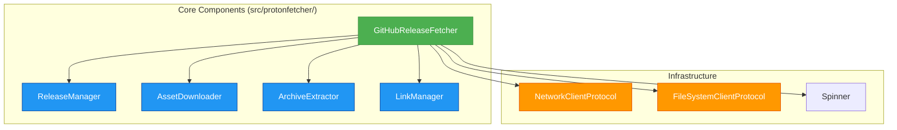

# ProtonFetcher Design Specification

## Overview

ProtonFetcher is a Python module designed to fetch and extract the latest ProtonGE GitHub release assets. It supports multiple Proton forks (GE-Proton and Proton-EM) and provides functionality to download, verify, extract, and manage symbolic links with progress indication.

## Architecture

The module follows a modular design with clear separation of concerns and dependency injection, organized under the `src/protonfetcher/` package:

The architecture uses Protocol-based dependency injection to enable easy testing and component substitution. The GitHubReleaseFetcher serves as the main orchestrator that instantiates and coordinates specialized managers rather than implementing all functionality directly. Each component is responsible for a specific domain:

- **GitHubReleaseFetcher**: Main orchestration and coordination of the entire workflow, validates environment and directories, and manages the overall process flow
- **ReleaseManager**: Handles release discovery, GitHub API interactions, asset name resolution, and size caching with XDG-compliant cache storage
- **AssetDownloader**: Manages download operations with progress indication, caching based on file size comparison, and fallback mechanisms
- **ArchiveExtractor**: Handles archive extraction with progress indication for both `.tar.gz` and `.tar.xz` formats using both tarfile library and system tar commands
- **LinkManager**: Manages symbolic links ensuring they point to the latest versions, handles link creation, listing, and removal with intelligent version sorting

## Core Components

### Module Structure

- `src/protonfetcher/common.py` - Shared types, enums, protocols, and constants
- `src/protonfetcher/exceptions.py` - Custom exception hierarchy
- `src/protonfetcher/utils.py` - Utility functions used across components
- `src/protonfetcher/network.py` - Network client implementation
- `src/protonfetcher/filesystem.py` - File system client implementation
- `src/protonfetcher/spinner.py` - Progress indication implementation
- `src/protonfetcher/release_manager.py` - Release management logic
- `src/protonfetcher/asset_downloader.py` - Download management logic
- `src/protonfetcher/archive_extractor.py` - Archive extraction logic
- `src/protonfetcher/link_manager.py` - Symlink management logic
- `src/protonfetcher/github_fetcher.py` - Main orchestrator
- `src/protonfetcher/cli.py` - CLI interface and logic
- `src/entry.py` - Entry point for zipapp distribution

### GitHubReleaseFetcher

Main orchestrator coordinating all operations:

- `fetch_and_extract`: Main entry point that coordinates the complete workflow of downloading, extracting, and managing links with progress indication
- `list_links`: Lists managed symbolic links for a specified fork
- `remove_release`: Removes specified releases and their associated links
- `list_recent_releases`: Lists available releases for selection
- `_validate_environment`: Validates required tools like curl are available
- `_ensure_directories_writable`: Validates output and extract directories are writable
- `_determine_release_tag`: Determines the release tag to use (latest or manual)
- `_download_asset`: Downloads the appropriate asset file for the release
- `_extract_and_manage_links`: Handles extraction and link management

### ReleaseManager

Handles release discovery and asset finding with caching:

- `fetch_latest_tag`: Gets latest release tag from GitHub using redirects
- `find_asset_by_name`: Finds asset files by name with both GitHub API and HTML fallback approaches
- `get_remote_asset_size`: Retrieves asset size using HEAD requests with persistent cache storage
- `list_recent_releases`: Fetches list of recent releases from GitHub API
- `_get_cached_asset_size`: Internal method to retrieve cached asset sizes from XDG-compliant cache
- `_cache_asset_size`: Internal method to cache asset sizes to XDG-compliant cache

### AssetDownloader

Manages downloads with progress indication and caching:

- `download_asset`: Main download method with file size comparison caching and progress indication
- `curl_get`, `curl_head`, `curl_download`: Makes requests using curl with performance optimizations
- `download_with_spinner`: Downloads file with progress spinner using urllib for fallback

### ArchiveExtractor

Extracts archives with progress indication:

- `extract_archive`: Main extraction method with format detection and fallback mechanisms
- `extract_with_tarfile`: Uses Python's tarfile library with detailed progress indication
- `extract_gz_archive`, `extract_xz_archive`: Specialized methods for different formats using system tar
- `_extract_with_system_tar`: Fallback extraction using system tar command
- `get_archive_info`: Retrieves information about archive without extracting
- `is_tar_file`: Validates if file is a tar file
- Configurable progress display with `show_progress` and `show_file_details`

### LinkManager

Manages symbolic links ensuring they point to newest versions:

- `create_symlinks`: Creates managed symbolic links with priority ordering
- `list_links`: Lists existing managed links with target information
- `remove_release`: Removes specified releases and updates links
- `manage_proton_links`: Ensures symlinks point to the newest versions with intelligent version sorting
- `get_link_names_for_fork`: Gets appropriate symlink names based on fork type
- `find_version_candidates`: Discovers and parses version information from directories
- `_handle_manual_release_directory`: Special handling for manual release scenarios
- `_deduplicate_candidates`: Removes duplicate version entries, preferring standard naming
- `_create_symlink_specs`: Creates specification objects for symlink management

### CLI Interface

Provides command-line functionality:

- `main`: CLI entry point function
- `parse_arguments`: Parses command-line arguments with validation
- `setup_logging`: Configures logging based on debug flag
- `convert_fork_to_enum`: Converts fork argument to ForkName enum
- `_handle_*_operation_flow` methods: Handle different operation flows (ls, list, rm, default)
- Supports multiple operations: fetch, list, remove, show links

## CLI Interface

### Features and Options

- `--extract-dir`, `-x`: Directory to extract to (default: `~/.steam/steam/compatibilitytools.d/`)
- `--output`, `-o`: Directory to download to (default: `~/Downloads/`)
- `--release`, `-r`: Specify release tag instead of latest
- `--fork`, `-f`: Fork to download (GE-Proton, Proton-EM)
- `--list`, `-l`: List recent releases
- `--ls`: List managed symbolic links for all or specified fork
- `--rm`: Remove specific release and update links accordingly
- `--debug`: Enable debug logging

### Validation and Constraints

- `--list` and `--release` cannot be used together
- `--ls` cannot be used with `--release`, `--list`, or `--rm`
- `--rm` cannot be used with `--release`, `--list`, or `--ls`
- Path validation and directory permission checks
- Fork name validation using ForkName enum
- Environment validation to ensure required tools (curl) are available
- Directory writability validation for both output and extract directories

### Operation Flows

The CLI supports multiple distinct operation modes:
- **Default (fetch and extract)**: Downloads and extracts the latest or specified release
- **List releases (`--list`)**: Fetches and displays recent releases from GitHub API
- **List links (`--ls`)**: Displays managed symbolic links and their targets
- **Remove release (`--rm`)**: Removes specified release directory and updates symlinks

## Fork Configuration System

The application supports multiple Proton forks through structured configuration:

- `ForkName`: StrEnum containing `GE_PROTON` and `PROTON_EM`
- `ForkConfig`: Dataclass containing repository and archive format for each fork
- `FORKS`: Dictionary mapping ForkName enum values to ForkConfig objects
- Different archive formats: GE-Proton uses `.tar.gz`, Proton-EM uses `.tar.xz`
- Link management creates appropriate symlink names per fork:
  - GE-Proton: `GE-Proton`, `GE-Proton-Fallback`, `GE-Proton-Fallback2`
  - Proton-EM: `Proton-EM`, `Proton-EM-Fallback`, `Proton-EM-Fallback2`
- Fork-specific version parsing to handle different naming conventions
- Repository-specific asset naming and detection strategies
- Different extraction path handling (Proton-EM may use `proton-` prefix in directory names)
- Separate asset size caching per fork and asset combination

## Error Handling

Comprehensive error hierarchy with specific exception types for different failure scenarios:

- `ProtonFetcherError`: Base exception for all ProtonFetcher operations (backward compatible alias: `FetchError`)
- `NetworkError`: Network-related failures including HTTP errors, connection timeouts, and API rate limit exceeded
- `ExtractionError`: Archive extraction failures including corrupted archives, disk space issues, and format incompatibilities
- `LinkManagementError`: Link management failures including permission errors, broken symlinks, and directory access issues
- `MultiLinkManagementError`: Batch operation failures (ExceptionGroup) for handling multiple link management errors simultaneously

Each component raises appropriate exceptions with detailed error messages that include:
- Context-specific information (URLs, file paths, fork names)
- Specific error causes when available
- Actionable guidance for troubleshooting
- Proper exception chaining to preserve error context

## Testing Approach

The test suite employs multiple testing strategies to ensure comprehensive coverage:

- **Unit Tests**: Component-specific tests with focused responsibility for individual methods and classes
- **Integration Tests**: Workflow-oriented tests verifying multiple components work together, including complete fetch-and-extract workflows
- **CLI Tests**: Validation of command-line interface functionality, argument parsing, and operation flows
- **Quality Tests**: Complexity regression and maintainability checks using tools like Radon
- **Parametrized Tests**: Fork-specific testing using `@pytest.mark.parametrize` for both GE-Proton and Proton-EM scenarios
- **Mock-based Testing**: Protocol-based dependency injection enables comprehensive testing of error scenarios and isolated functionality
- **Error Handling Tests**: Specific tests for each exception type and error recovery scenarios
- **Fork-Specific Tests**: Dedicated test suites for both GE-Proton (tar.gz) and Proton-EM (tar.xz) fork behaviors
- **Validation Tests**: Tests for input validation, directory permissions, and environment checks
- **Cache Behavior Tests**: Tests for asset size caching, XDG cache compliance, and cache invalidation scenarios
- **Symbolic Link Tests**: Tests for link creation, management, removal, and version sorting functionality

## Dependencies and Features

- **Standard library**: argparse, dataclasses, hashlib, json, logging, os, re, shutil, subprocess, sys, tarfile, time, urllib, pathlib, enum, typing
- **System dependencies**: curl (for network operations and downloads), tar (for archive extraction)
- **Modern Python 3.11+ features**: `StrEnum`, built-in generics, `match/case`, dataclasses, protocols, ExceptionGroup, type hints
- **XDG caching**: File-based caching system using XDG_CACHE_HOME (or ~/.cache) for asset size information with configurable expiration
- **Configurable progress**: FPS-limited progress indication with detailed file information during extraction
- **Environment validation**: Tool availability checks (curl) and directory permission validation before operations
- **Protocol-based architecture**: Abstract protocols for network and filesystem operations enabling comprehensive mocking in tests
- **Dual extraction methods**: Support for both Python tarfile library and system tar command with fallback mechanisms
- **Intelligent version parsing**: Sophisticated version comparison for proper sorting of multiple Proton releases
- **Symlink management**: Automated symlink creation and management with fallback chains (main, fallback, fallback2)
- **Network resilience**: Multiple fallback strategies for GitHub API access including HTML parsing as backup
- **Asset verification**: Local file caching based on size comparison to avoid unnecessary downloads
- **Comprehensive error handling**: Specific exception types for different failure scenarios with detailed context
