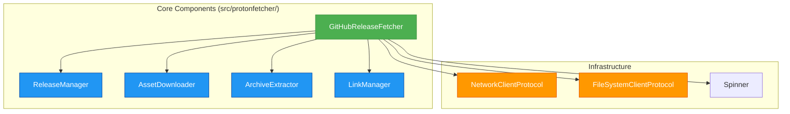

# ProtonFetcher Design Specification

## Overview

ProtonFetcher is a Python module designed to fetch and extract the latest ProtonGE GitHub release assets. It supports multiple Proton forks (GE-Proton and Proton-EM) and provides functionality to download, verify, extract, and manage symbolic links with progress indication.

## Architecture

The module follows a modular design with clear separation of concerns and dependency injection, organized under the `src/protonfetcher/` package:

The architecture uses Protocol-based dependency injection to enable easy testing and component substitution. The GitHubReleaseFetcher serves as the main orchestrator that instantiates and coordinates specialized managers rather than implementing all functionality directly.

## Core Components

### Module Structure

- `src/protonfetcher/common.py` - Shared types, enums, protocols, and constants
- `src/protonfetcher/exceptions.py` - Custom exception hierarchy
- `src/protonfetcher/utils.py` - Utility functions used across components
- `src/protonfetcher/network.py` - Network client implementation
- `src/protonfetcher/filesystem.py` - File system client implementation
- `src/protonfetcher/spinner.py` - Progress indication implementation
- `src/protonfetcher/release_manager.py` - Release management logic
- `src/protonfetcher/asset_downloader.py` - Download management logic
- `src/protonfetcher/archive_extractor.py` - Archive extraction logic
- `src/protonfetcher/link_manager.py` - Symlink management logic
- `src/protonfetcher/github_fetcher.py` - Main orchestrator
- `src/protonfetcher/cli.py` - CLI interface and logic
- `src/entry.py` - Entry point for zipapp distribution

### GitHubReleaseFetcher

Main orchestrator coordinating all operations:

- `fetch_and_extract`: Downloads and extracts releases with progress indication
- `list_links`: Lists managed symbolic links for a specified fork
- `remove_release`: Removes specified releases and their associated links
- `list_recent_releases`: Lists available releases for selection
- `_validate_environment`: Validates required tools like curl are available
- `_ensure_directories_writable`: Validates output and extract directories

### ReleaseManager

Handles release discovery and asset finding with caching:

- `fetch_latest_tag`: Gets latest release tag from GitHub using redirects
- `find_asset_by_name`: Finds asset files by name with GitHub API fallback
- `get_remote_asset_size`: Retrieves asset size using HEAD requests with caching
- `list_recent_releases`: Fetches list of recent releases from GitHub API

### AssetDownloader

Manages downloads with progress indication and caching:

- `download_asset`: Downloads asset with progress indication and caching
- `curl_get`, `curl_head`, `curl_download`: Makes requests using curl
- `download_with_spinner`: Downloads file with progress spinner using urllib

### ArchiveExtractor

Extracts archives with progress indication:

- `extract_archive`: Main extraction method with format detection
- `extract_with_tarfile`: Uses Python's tarfile library
- `extract_gz_archive`, `extract_xz_archive`: Specialized methods for different formats
- Configurable progress display with `show_progress` and `show_file_details`

### LinkManager

Manages symbolic links ensuring they point to newest versions:

- `create_symlinks`: Creates managed symbolic links with priority ordering
- `list_links`: Lists existing managed links with target information
- `remove_release`: Removes specified releases and updates links
- `manage_proton_links`: Ensures symlinks point to the newest versions

### CLI Interface

Provides command-line functionality:

- `main`: CLI entry point function
- `parse_arguments`: Parses command-line arguments
- Supports multiple operations: fetch, list, remove, show links

## CLI Interface

### Features and Options

- `--extract-dir`, `-x`: Directory to extract to (default: `~/.steam/steam/compatibilitytools.d/`)
- `--output`, `-o`: Directory to download to (default: `~/Downloads/`)
- `--release`, `-r`: Specify release tag instead of latest
- `--fork`, `-f`: Fork to download (GE-Proton, Proton-EM)
- `--list`, `-l`: List recent releases
- `--ls`: List managed links
- `--rm`: Remove specific release
- `--debug`: Enable debug logging

### Validation and Constraints

- `--ls` cannot be used with `--rm`, `--list`, or `--release`
- `--rm` cannot be used with `--ls`, `--list`, or `--release`
- `--list` cannot be used with `--release`
- Path validation and directory permission checks
- Fork name validation using ForkName enum

## Fork Configuration System

The application supports multiple Proton forks through structured configuration:

- `ForkName`: StrEnum containing `GE_PROTON` and `PROTON_EM`
- `ForkConfig`: Dataclass containing repository and archive format for each fork
- `FORKS`: Dictionary mapping ForkName enum values to ForkConfig objects
- Different archive formats: GE-Proton uses `.tar.gz`, Proton-EM uses `.tar.xz`
- Link management creates appropriate symlink names per fork

## Error Handling

Comprehensive error hierarchy:

- `ProtonFetcherError`: Base exception (alias: `FetchError`)
- `NetworkError`: Network failures
- `ExtractionError`: Archive extraction failures
- `LinkManagementError`: Link management failures
- `MultiLinkManagementError`: Batch operation failures (ExceptionGroup)

## Testing Approach

The test suite includes:

- **Unit Tests**: Component-specific tests with focused responsibility
- **Integration Tests**: Workflow-oriented tests verifying multiple components work together
- **CLI Tests**: Validation of command-line interface functionality and error handling
- **Quality Tests**: Complexity regression and maintainability checks
- **Parametrized Tests**: Fork-specific testing using `@pytest.mark.parametrize`
- **Mock-based Testing**: Protocol-based dependency injection enables comprehensive testing

## Dependencies and Features

- **Standard library**: argparse, dataclasses, hashlib, json, logging, os, re, shutil, subprocess, sys, tarfile, time, urllib, pathlib, enum
- **System dependencies**: curl, tar
- **Modern Python 3.11+ features**: `StrEnum`, built-in generics, `match/case`, dataclasses, protocols, ExceptionGroup, type hints
- **XDG caching**: File-based caching for improved performance
- **Configurable progress**: FPS-limited progress indication with file details
- **Environment validation**: Tool availability checks before operations
