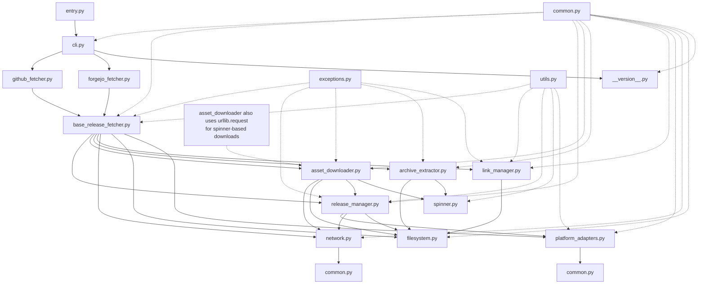
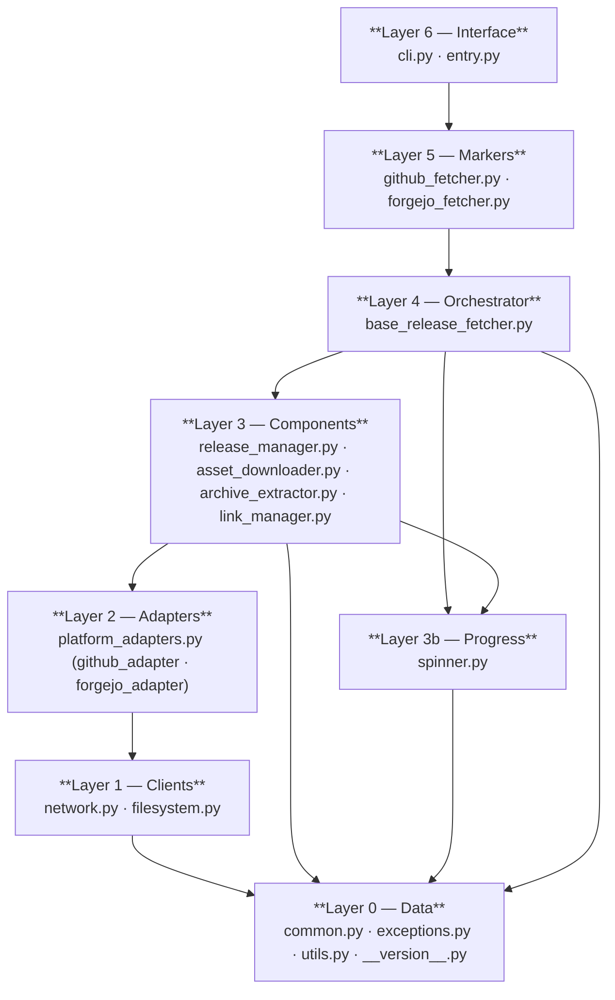
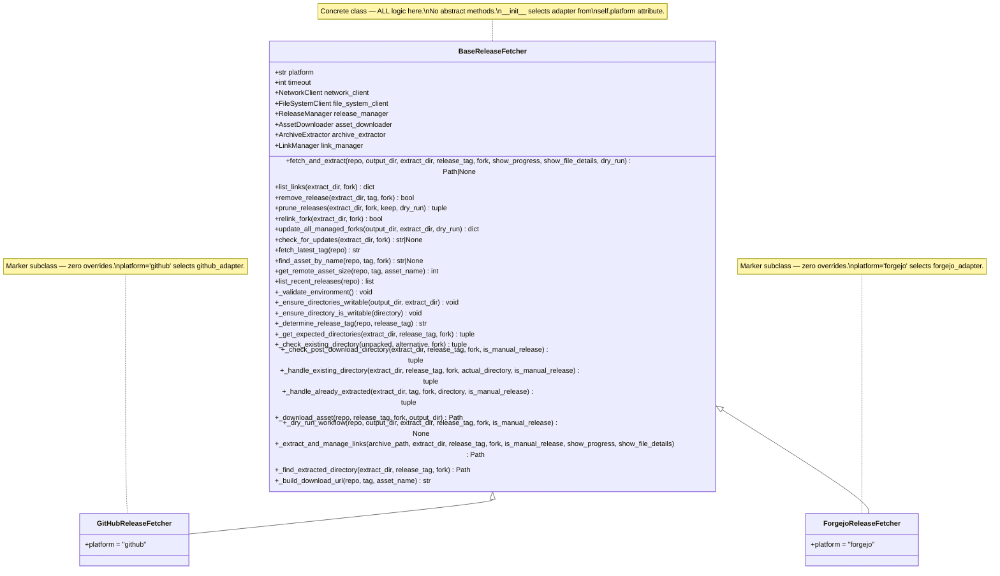
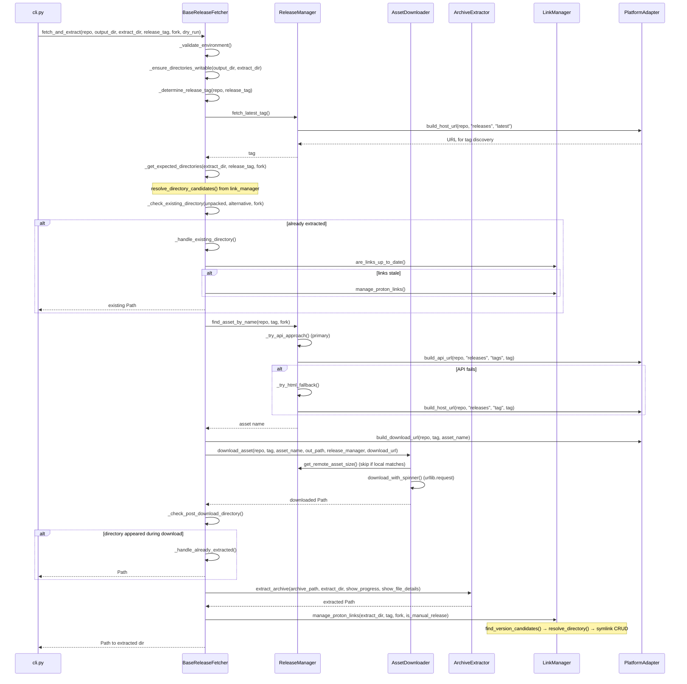
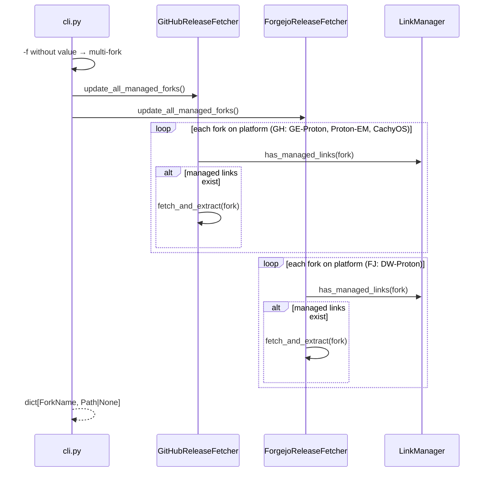
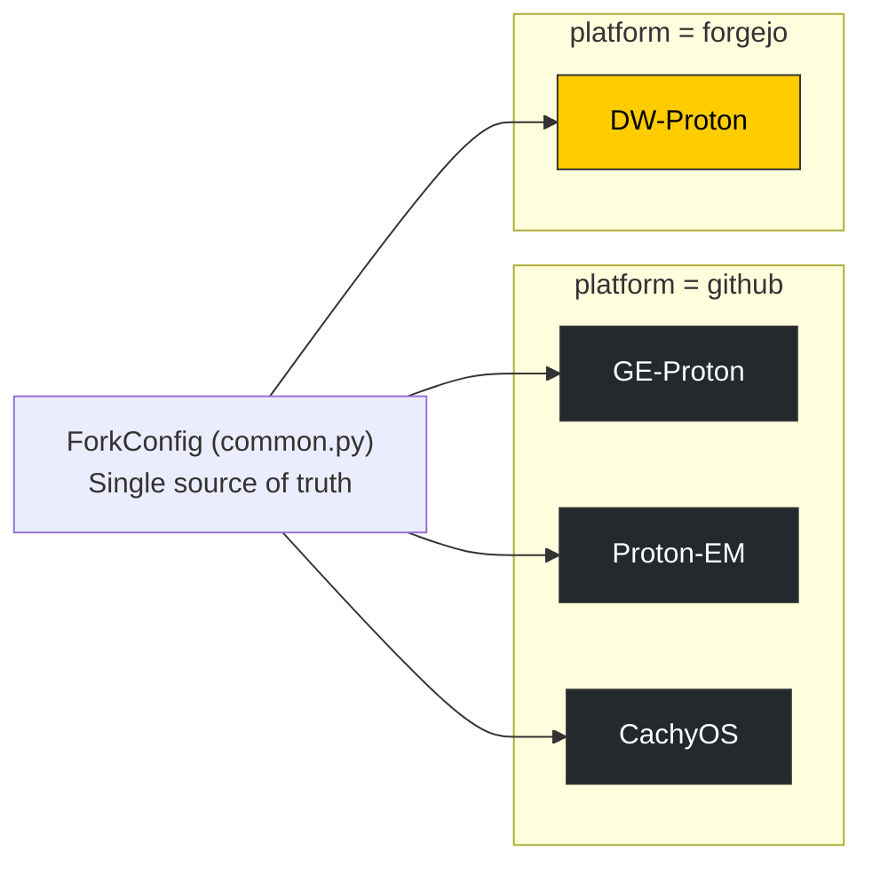
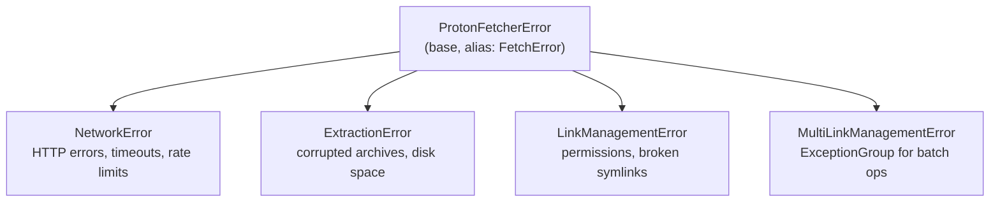
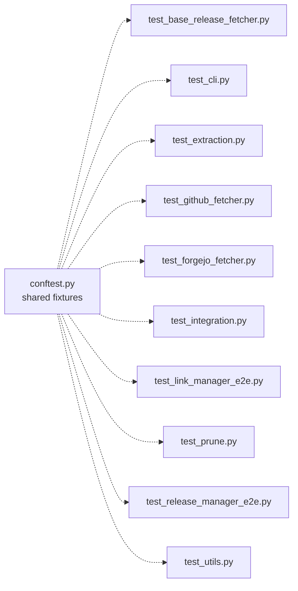

# ProtonFetcher — Mermaid Navigation Maps

> Each graph is a navigable map for agents to locate code, trace dependencies, and understand data flow.
> All paths relative to `src/protonfetcher/` unless noted.

---

## 1. Dependency Graph — Module Imports

```mermaid
graph TD
    cli["cli.py"] --> github_fetcher["github_fetcher.py"]
    cli --> forgejo_fetcher["forgejo_fetcher.py"]
    cli --> version["__version__.py"]

    github_fetcher --> base_fetcher["base_release_fetcher.py"]
    forgejo_fetcher --> base_fetcher

    base_fetcher --> release_mgr["release_manager.py"]
    base_fetcher --> asset_dl["asset_downloader.py"]
    base_fetcher --> archive_ext["archive_extractor.py"]
    base_fetcher --> link_mgr["link_manager.py"]
    base_fetcher --> net["network.py"]
    base_fetcher --> fs["filesystem.py"]
    base_fetcher --> adapters["platform_adapters.py"]

    release_mgr --> adapters
    release_mgr --> net
    release_mgr --> fs

    asset_dl --> net
    asset_dl --> fs
    asset_dl --> release_mgr
    asset_dl --> spinner["spinner.py"]
    note_dl["asset_downloader also uses urllib.request
for spinner-based downloads"] -.-> asset_dl

    archive_ext --> fs
    archive_ext --> spinner

    link_mgr --> fs

    adapters --> common_ad["common.py"]

    net --> common_net["common.py"]

    common["common.py"] -.-> cli
    common -.-> base_fetcher
    common -.-> release_mgr
    common -.-> asset_dl
    common -.-> archive_ext
    common -.-> link_mgr
    common -.-> adapters
    common -.-> net
    common -.-> fs
    common -.-> version

    exceptions["exceptions.py"] -.-> base_fetcher
    exceptions -.-> release_mgr
    exceptions -.-> asset_dl
    exceptions -.-> archive_ext
    exceptions -.-> link_mgr

    utils["utils.py"] -.-> base_fetcher
    utils -.-> link_mgr
    utils -.-> release_mgr
    utils -.-> spinner
    utils -.-> adapters

    entry["entry.py"] --> cli

    class common fill:#d4edda
    class exceptions fill:#f8d7da
    class utils fill:#d1ecf1
    class version fill:#e8f5e9
```

**Legend:** `-->` = direct import, `-.->` = shared dependency (common/exceptions/utils imported by many)

**Notes on actual imports:**

- `cli.py` does NOT import `base_release_fetcher` — it instantiates `GitHubReleaseFetcher` and `ForgejoReleaseFetcher` directly
- `release_manager.py` imports `github_adapter` from `platform_adapters` directly (not via base_fetcher)
- `asset_downloader.py` uses `urllib.request.urlopen()` for spinner-based downloads (bypasses `NetworkClient`)
- `spinner.py` imports `format_rate` from `utils.py`
- `network.py` imports `Headers`, `ProcessResult` from `common.py`
- `archive_extractor.py` uses `subprocess` and `tarfile` from stdlib
- `link_manager.py` uses `re` from stdlib; `resolve_directory()` and `resolve_directory_candidates()` are module-level functions (not class methods)

---

## 2. Architecture Layers

```mermaid
graph TD
    L6["**Layer 6 — Interface**<br/>cli.py · entry.py"]
    L5["**Layer 5 — Markers**<br/>github_fetcher.py · forgejo_fetcher.py"]
    L4["**Layer 4 — Orchestrator**<br/>base_release_fetcher.py"]
    L3["**Layer 3 — Components**<br/>release_manager.py · asset_downloader.py · archive_extractor.py · link_manager.py"]
    L3b["**Layer 3b — Progress**<br/>spinner.py"]
    L2["**Layer 2 — Adapters**<br/>platform_adapters.py (github_adapter · forgejo_adapter)"]
    L1["**Layer 1 — Clients**<br/>network.py · filesystem.py"]
    L0["**Layer 0 — Data**<br/>common.py · exceptions.py · utils.py · __version__.py"]

    L6 --> L5
    L5 --> L4
    L4 --> L3
    L4 --> L3b
    L3 --> L2
    L3 --> L3b
    L2 --> L1
    L1 --> L0
    L3 --> L0
    L3b --> L0
    L4 --> L0

    class L0 fill:#e8f5e9,stroke:#4caf50
    class L1 fill:#e3f2fd,stroke:#2196f3
    class L2 fill:#fff3e0,stroke:#ff9800
    class L3 fill:#f3e5f5,stroke:#9c27b0
    class L3b fill:#e1f5fe,stroke:#00bcd4
    class L4 fill:#fce4ec,stroke:#e91e63
    class L5 fill:#fff9c4,stroke:#fdd835
    class L6 fill:#e0f7fa,stroke:#00bcd4
```

**Cross-layer notes:**

- `release_manager` imports `platform_adapters` directly (not via `base_release_fetcher`)
- `asset_downloader` calls `release_manager.get_remote_asset_size()` (reverse dependency for size checks)
- `asset_downloader` uses `urllib.request` directly for spinner downloads (bypasses `network.py`)
- `spinner` imports `format_rate` from `utils`

---

## 3. Fetcher Hierarchy — Class Inheritance

```mermaid
classDiagram
    class BaseReleaseFetcher {
        +str platform
        +int timeout
        +NetworkClient network_client
        +FileSystemClient file_system_client
        +ReleaseManager release_manager
        +AssetDownloader asset_downloader
        +ArchiveExtractor archive_extractor
        +LinkManager link_manager
        +fetch_and_extract(repo, output_dir, extract_dir, release_tag, fork, show_progress, show_file_details, dry_run) Path|None
        +list_links(extract_dir, fork) dict
        +remove_release(extract_dir, tag, fork) bool
        +prune_releases(extract_dir, fork, keep, dry_run) tuple
        +relink_fork(extract_dir, fork) bool
        +update_all_managed_forks(output_dir, extract_dir, dry_run) dict
        +check_for_updates(extract_dir, fork) str|None
        +fetch_latest_tag(repo) str
        +find_asset_by_name(repo, tag, fork) str|None
        +get_remote_asset_size(repo, tag, asset_name) int
        +list_recent_releases(repo) list
        +_validate_environment() void
        +_ensure_directories_writable(output_dir, extract_dir) void
        +_ensure_directory_is_writable(directory) void
        +_determine_release_tag(repo, release_tag) str
        +_get_expected_directories(extract_dir, release_tag, fork) tuple
        +_check_existing_directory(unpacked, alternative, fork) tuple
        +_check_post_download_directory(extract_dir, release_tag, fork, is_manual_release) tuple
        +_handle_existing_directory(extract_dir, release_tag, fork, actual_directory, is_manual_release) tuple
        +_handle_already_extracted(extract_dir, tag, fork, directory, is_manual_release) tuple
        +_download_asset(repo, release_tag, fork, output_dir) Path
        +_dry_run_workflow(repo, output_dir, extract_dir, release_tag, fork, is_manual_release) None
        +_extract_and_manage_links(archive_path, extract_dir, release_tag, fork, is_manual_release, show_progress, show_file_details) Path
        +_find_extracted_directory(extract_dir, release_tag, fork) Path
        +_build_download_url(repo, tag, asset_name) str
    }
    class GitHubReleaseFetcher {
        +platform = "github"
    }
    class ForgejoReleaseFetcher {
        +platform = "forgejo"
    }

    BaseReleaseFetcher <|-- GitHubReleaseFetcher
    BaseReleaseFetcher <|-- ForgejoReleaseFetcher

    note for BaseReleaseFetcher "Concrete class — ALL logic here.\nNo abstract methods.\n__init__ selects adapter from\nself.platform attribute."
    note for GitHubReleaseFetcher "Marker subclass — zero overrides.\nplatform='github' selects github_adapter."
    note for ForgejoReleaseFetcher "Marker subclass — zero overrides.\nplatform='forgejo' selects forgejo_adapter."
```

---

## 4. Platform Adapter Protocol & Selection

```mermaid
classDiagram
    PlatformAdapter o-- GitHubPlatformAdapter
    PlatformAdapter o-- ForgejoPlatformAdapter

    class PlatformAdapter {
        <<Protocol in common.py>>
        +str api_base
        +str host_base
        +build_api_url(repo, *parts) str
        +build_download_url(repo, tag, asset_name) str
        +build_host_url(repo, *parts) str
        +dict default_headers
    }
    class GitHubPlatformAdapter {
        <<Concrete class>>
        api_base = "https://api.github.com"
        host_base = "https://github.com"
        headers = {Accept: vnd.github.v3+json, User-Agent: ...}
    }
    class ForgejoPlatformAdapter {
        <<Concrete class>>
        api_base = "https://dawn.wine/api/v1"
        host_base = "https://dawn.wine"
        headers = {Accept: application/json, User-Agent: ...}
    }

    note for PlatformAdapter "Protocol defined in common.py.\nConcrete classes in platform_adapters.py\nuse duck typing (no explicit inheritance).\nSingletons exported:\ngithub_adapter · forgejo_adapter\nSelection in BaseReleaseFetcher.__init__\nby self.platform attribute."
```

**Selection flow:**

1. `BaseReleaseFetcher.__init__` reads `self.platform` (set by subclass)
2. Chooses `github_adapter` if `platform == "github"`, else `forgejo_adapter`
3. Adapter is passed to `ReleaseManager` constructor
4. `ReleaseManager` uses adapter for all URL construction

---

## 5. Data Flow — Fetch & Extract

```mermaid
sequenceDiagram
    participant CLI as cli.py
    participant Fetcher as BaseReleaseFetcher
    participant RM as ReleaseManager
    participant AD as AssetDownloader
    participant AE as ArchiveExtractor
    participant LM as LinkManager
    participant PA as PlatformAdapter

    CLI->>Fetcher: fetch_and_extract(repo, output_dir, extract_dir, release_tag, fork, dry_run)
    Fetcher->>Fetcher: _validate_environment()
    Fetcher->>Fetcher: _ensure_directories_writable(output_dir, extract_dir)
    Fetcher->>Fetcher: _determine_release_tag(repo, release_tag)
    Fetcher->>RM: fetch_latest_tag()
    RM->>PA: build_host_url(repo, "releases", "latest")
    PA-->>RM: URL for tag discovery
    RM-->>Fetcher: tag

    Fetcher->>Fetcher: _get_expected_directories(extract_dir, release_tag, fork)
    Note over Fetcher: resolve_directory_candidates() from link_manager

    Fetcher->>Fetcher: _check_existing_directory(unpacked, alternative, fork)
    alt already extracted
        Fetcher->>Fetcher: _handle_existing_directory()
        Fetcher->>LM: are_links_up_to_date()
        alt links stale
            Fetcher->>LM: manage_proton_links()
        end
        Fetcher-->>CLI: existing Path
    end

    Fetcher->>RM: find_asset_by_name(repo, tag, fork)
    RM->>RM: _try_api_approach() (primary)
    RM->>PA: build_api_url(repo, "releases", "tags", tag)
    alt API fails
        RM->>RM: _try_html_fallback()
        RM->>PA: build_host_url(repo, "releases", "tag", tag)
    end
    RM-->>Fetcher: asset name

    Fetcher->>PA: build_download_url(repo, tag, asset_name)
    Fetcher->>AD: download_asset(repo, tag, asset_name, out_path, release_manager, download_url)
    AD->>RM: get_remote_asset_size() (skip if local matches)
    AD->>AD: download_with_spinner() (urllib.request)
    AD-->>Fetcher: downloaded Path

    Fetcher->>Fetcher: _check_post_download_directory()
    alt directory appeared during download
        Fetcher->>Fetcher: _handle_already_extracted()
        Fetcher-->>CLI: Path
    end

    Fetcher->>AE: extract_archive(archive_path, extract_dir, show_progress, show_file_details)
    AE-->>Fetcher: extracted Path

    Fetcher->>LM: manage_proton_links(extract_dir, tag, fork, is_manual_release)
    Note over LM: find_version_candidates() → resolve_directory() → symlink CRUD

    Fetcher-->>CLI: Path to extracted dir
```

**Dry-run path:** If `dry_run=True`, `_dry_run_workflow()` is called instead of download/extract. It resolves asset info, shows what would be downloaded/extracted/linked, and returns `None`.

**Multi-fork path:** `update_all_managed_forks()` iterates `FORKS` filtered by `self.platform`, skips forks without managed links, and calls `fetch_and_extract()` for each.

---

## 6. Data Flow — Multi-Fork Update

```mermaid
sequenceDiagram
    participant CLI as cli.py
    participant GH as GitHubReleaseFetcher
    participant FJ as ForgejoReleaseFetcher
    participant LM as LinkManager

    CLI->>CLI: -f without value → multi-fork
    CLI->>GH: update_all_managed_forks()
    CLI->>FJ: update_all_managed_forks()

    loop each fork on platform (GH: GE-Proton, Proton-EM, CachyOS)
        GH->>LM: has_managed_links(fork)
        alt managed links exist
            GH->>GH: fetch_and_extract(fork)
        end
    end

    loop each fork on platform (FJ: DW-Proton)
        FJ->>LM: has_managed_links(fork)
        alt managed links exist
            FJ->>FJ: fetch_and_extract(fork)
        end
    end

    CLI-->>CLI: dict[ForkName, Path|None]
```

---

## 7. CLI Operation Map

```mermaid
graph TD
    ROOT["CLI Entry\nentry.py → cli.main()"]

    ROOT --> DEFAULT["default (no flags)\n→ ls all forks' links"]
    ROOT --> FETCH["--fork / -f VALUE\nfetch_and_extract()"]
    ROOT --> MULTI["-f (no value)\nupdate_all_managed_forks()"]
    ROOT --> LIST["--list / -l\nlist_recent_releases()"]
    ROOT --> LS["--ls\nlist_links()"]
    ROOT --> RM["--rm TAG\nremove_release()"]
    ROOT --> RELINK["--relink\nrelink_fork() (requires --fork)"]
    ROOT --> PRUNE["--prune\nprune_releases()"]
    ROOT --> CHECK["--check / -c\ncheck_for_updates()"]
    ROOT --> DRY["--dry-run / -n\ndry_run=True"]
    ROOT --> VERSION["--version / -V\nprint version, exit"]
    ROOT --> RELEASE["--release / -r\nmanual tag (mutually exclusive with -l/-r)"]

    FETCH --> GH["platform=github → GitHubReleaseFetcher"]
    FETCH --> FJ["platform=forgejo → ForgejoReleaseFetcher"]

    MULTI --> GH2["GitHubReleaseFetcher.update_all_managed_forks()"]
    MULTI --> FJ2["ForgejoReleaseFetcher.update_all_managed_forks()"]

    class DEFAULT fill:#e8f5e9
    class FETCH fill:#e3f2fd
    class MULTI fill:#fff3e0
    class LIST fill:#f3e5f5
    class LS fill:#e0f7fa
    class RM fill:#ffebee
    class RELINK fill:#fce4ec
    class PRUNE fill:#fff9c4
    class CHECK fill:#e1f5fe
    class DRY fill:#f1f8e9
    class VERSION fill:#e0f7fa
    class RELEASE fill:#fff9c4
```

**Default behavior (no flags):** Calls `_handle_ls_operation` with `list_all_forks=True` — lists links for ALL forks.

**Dispatch logic in `_dispatch()`:** Operations are resolved by checking `args` flags in priority order: `ls` → `list` → `relink` → `rm` → `prune` → `check`. If none match, falls through to `_resolve_default_operation()` which checks for explicit `--fork`/`--release` flags or defaults to listing all forks' links.

**Validation:** `_validate_mutually_exclusive_args()` enforces: `--check` vs `--dry-run`, `--check` vs `--list`/`--ls`, `--prune` vs `--check`, `--dry-run` vs read-only ops, `--relink` requires `--fork`.

---

## 8. Fork Configuration — Data Map

```mermaid
graph LR
    FC["ForkConfig (common.py)\nSingle source of truth"]

    GEP["GE-Proton"]
    PEM["Proton-EM"]
    CCH["CachyOS"]
    DWP["DW-Proton"]

    FC --> GEP
    FC --> PEM
    FC --> CCH
    FC --> DWP

    subgraph GitHub ["platform = github"]
        GEP
        PEM
        CCH
    end

    subgraph Forgejo ["platform = forgejo"]
        DWP
    end

    click GEP "https://github.com/GloriousEggroll/proton-ge-custom"
    click PEM "https://github.com/Etaash-mathamsetty/Proton"
    click CCH "https://github.com/CachyOS/proton-cachyos"
    click DWP "https://dawn.wine/dawn-winery/dwproton"

    classDef github fill:#24292e,stroke:#333,color:#fff
    classDef forgejo fill:#ffcc00,stroke:#333,color:#000
    class GEP,PEM,CCH github
    class DWP forgejo
```

**ForkConfig fields used by each component:**

| Field                                | Used By                                             |
| ------------------------------------ | --------------------------------------------------- |
| `repo`                               | ReleaseManager, PlatformAdapter                     |
| `archive_format`                     | ReleaseManager (extension matching)                 |
| `api_base` / `host_base`             | ForkConfig override (DW-Proton), PlatformAdapter    |
| `version_pattern` / `version_prefix` | utils.parse_version(), LinkManager                  |
| `is_ge_proton`                       | utils.parse_version() (GE-Proton tuple mapping)     |
| `link_names`                         | LinkManager.manage_proton_links()                   |
| `skip_prefixes`                      | LinkManager.\_should_skip_directory()               |
| `asset_template`                     | utils.get_proton_asset_name(), ReleaseManager       |
| `dir_name_templates`                 | resolve_directory(), resolve_directory_candidates() |
| `platform`                           | BaseReleaseFetcher → adapter selection              |

**ForkName enum values:** `GE_PROTON`, `PROTON_EM`, `CACHYOS`, `DW_PROTON`

**DEFAULT_FORK:** `ForkName.GE_PROTON` (used when `--fork` not specified and operation requires a single fork)

---

## 9. Exception Hierarchy

```mermaid
graph TD
    PF["ProtonFetcherError\n(base, alias: FetchError)"]
    NE["NetworkError\nHTTP errors, timeouts, rate limits"]
    EE["ExtractionError\ncorrupted archives, disk space"]
    LME["LinkManagementError\npermissions, broken symlinks"]
    MLME["MultiLinkManagementError\nExceptionGroup for batch ops"]

    PF --> NE
    PF --> EE
    PF --> LME
    PF --> MLME

    class PF fill:#f8d7da,stroke:#dc3545,color:#fff
    class NE fill:#fff3cd,stroke:#ffc107
    class EE fill:#d1ecf1,stroke:#0c5460
    class LME fill:#d4edda,stroke:#155724
    class MLME fill:#e2e3e5,stroke:#383d41
```

---

## 10. Protocol Interfaces

```mermaid
graph TD
    NCP["NetworkClientProtocol v1.0"]
    FSP["FileSystemClientProtocol v1.0"]
    PA["PlatformAdapter Protocol"]

    NCP --> GET["get(url, headers, stream)"]
    NCP --> HEAD["head(url, headers, follow_redirects)"]
    NCP --> DL["download(url, output_path, headers)"]

    FSP --> EXISTS["exists(path)"]
    FSP --> ISDIR["is_dir(path)"]
    FSP --> ISLINK["is_symlink(path)"]
    FSP --> MKDIR["mkdir(path, parents, exist_ok)"]
    FSP --> WRITE["write(path, data)"]
    FSP --> READ["read(path)"]
    FSP --> SIZE["size(path)"]
    FSP --> MTIME["mtime(path)"]
    FSP --> SYMLINK["symlink_to(link, target)"]
    FSP --> RESOLVE["resolve(path)"]
    FSP --> UNLINK["unlink(path)"]
    FSP --> RMR["rmtree(path)"]
    FSP --> ITER["iterdir(path)"]

    PA --> APIURL["build_api_url(repo, *parts)"]
    PA --> DLURL["build_download_url(repo, tag, asset)"]
    PA --> HOSTURL["build_host_url(repo, *parts)"]
    PA --> HDRS["default_headers"]

    NET["NetworkClient\n(curl-based)"] -.-> NCP
    FSC["FileSystemClient\n(pathlib-based)"] -.-> FSP
    GHA["GitHubPlatformAdapter"] -.-> PA
    FJA["ForgejoPlatformAdapter"] -.-> PA

    class NCP fill:#e3f2fd,stroke:#2196f3
    class FSP fill:#e8f5e9,stroke:#4caf50
    class PA fill:#fff3e0,stroke:#ff9800
```

---

## 11. Test Map

```mermaid
graph LR
    conftest["conftest.py\nshared fixtures"]

    test_fetcher["test_base_release_fetcher.py"]
    test_cli["test_cli.py"]
    test_extract["test_extraction.py"]
    test_github["test_github_fetcher.py"]
    test_forgejo["test_forgejo_fetcher.py"]
    test_integration["test_integration.py"]
    test_links["test_link_manager_e2e.py"]
    test_prune["test_prune.py"]
    test_rm_e2e["test_release_manager_e2e.py"]
    test_utils["test_utils.py"]

    conftest -.-> test_fetcher
    conftest -.-> test_cli
    conftest -.-> test_extract
    conftest -.-> test_github
    conftest -.-> test_forgejo
    conftest -.-> test_integration
    conftest -.-> test_links
    conftest -.-> test_prune
    conftest -.-> test_rm_e2e
    conftest -.-> test_utils

    class test_fetcher fill:#fce4ec
    class test_cli fill:#e0f7fa
    class test_extract fill:#e8f5e9
    class test_github fill:#e3f2fd
    class test_forgejo fill:#fff3e0
    class test_integration fill:#f3e5f5
    class test_links fill:#e1f5fe
    class test_prune fill:#fff9c4
    class test_rm_e2e fill:#ffebee
    class test_utils fill:#f1f8e9
```

---

## 12. Quick Navigation — "Where Do I Find…"

| Question                               | File                                             | Key Symbol                                                             |
| -------------------------------------- | ------------------------------------------------ | ---------------------------------------------------------------------- |
| Add a new fork?                        | `common.py`                                      | `ForkConfig`, `FORKS` dict, `ForkName` enum                            |
| Add a new platform?                    | `platform_adapters.py` + new fetcher marker      | `PlatformAdapter` protocol, singleton                                  |
| Change URL construction?               | `platform_adapters.py`                           | `build_api_url`, `build_download_url`                                  |
| Change download logic?                 | `asset_downloader.py`                            | `download_asset()`, `download_with_spinner()`                          |
| Change extraction?                     | `archive_extractor.py`                           | `extract_archive()`, `extract_gz_archive()`                            |
| Change symlink behavior?               | `link_manager.py`                                | `manage_proton_links()`, `create_symlinks()`                           |
| Directory resolution (tag → path)?     | `link_manager.py`                                | `resolve_directory()`, `resolve_directory_candidates()` (module-level) |
| Change CLI flags?                      | `cli.py`                                         | `argparse.ArgumentParser`, `_handle_*`, `_dispatch()`                  |
| Change version parsing?                | `utils.py` + `common.py`                         | `parse_version()`, `ForkConfig.version_pattern`                        |
| Change caching?                        | `release_manager.py`                             | `_cache_*` methods, XDG path                                           |
| Change progress display?               | `spinner.py`                                     | `Spinner` class, `format_progress_bar()`, `build_display_line()`       |
| Change error types?                    | `exceptions.py`                                  | `ProtonFetcherError` hierarchy                                         |
| Wire up a new operation?               | `base_release_fetcher.py`                        | Orchestrator methods                                                   |
| Network calls?                         | `network.py`                                     | `NetworkClient` (curl subprocess)                                      |
| Filesystem abstraction?                | `filesystem.py`                                  | `FileSystemClient` (pathlib wrapper)                                   |
| Version string?                        | `__version__.py`                                 | `__version__`, `_get_version()`                                        |
| Asset discovery (API → HTML fallback)? | `release_manager.py`                             | `_try_api_approach()`, `_try_html_fallback()`                          |
| Multi-fork update loop?                | `base_release_fetcher.py`                        | `update_all_managed_forks()`                                           |
| Dry-run logic?                         | `base_release_fetcher.py`                        | `_dry_run_workflow()`                                                  |
| Pruning logic?                         | `link_manager.py`                                | `prune_releases()`, `_compute_prune_plan()`                            |
| Update checking?                       | `base_release_fetcher.py` + `release_manager.py` | `check_for_updates()`, `check_for_newer_release()`                     |
