# ProtonFetcher Test Suite — Code Navigation Map

> Mermaid-first reference. For fixture docs, see [`FIXTURES.md`](FIXTURES.md).

---

## 1. Test Priority Pyramid

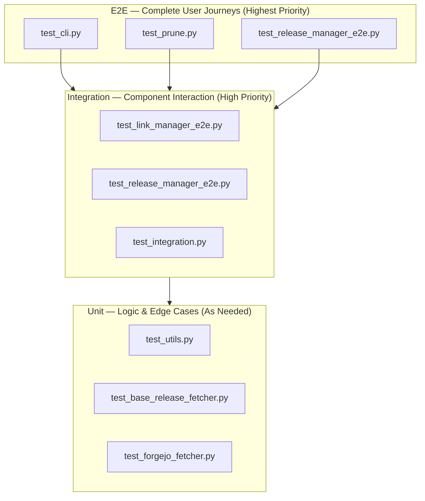

---

## 2. Test File → Source Module Mapping

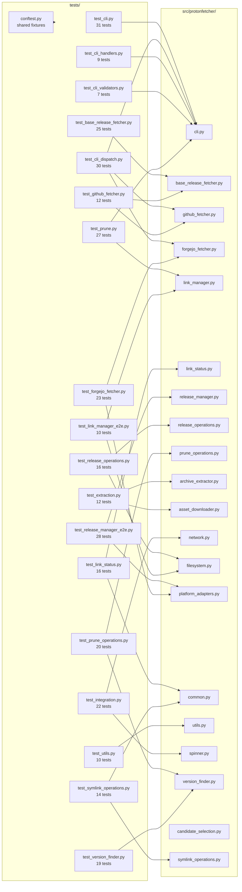

---

## 3. Adapter-Based Architecture & Test Implications

```mermaid
classDiagram
    class BaseReleaseFetcher {
        +platform: str
        +release_manager: ReleaseManager
        +fetch_and_extract()
        +check_for_newer()
        +remove_release()
        +relink_fork()
        +update_all_managed_forks()
    }

    class GitHubReleaseFetcher {
        <<marker>>
        platform = "github"
    }

    class ForgejoReleaseFetcher {
        <<marker>>
        platform = "forgejo"
    }

    class PlatformAdapter {
        <<protocol>>
        +api_base: str
        +host_base: str
        +default_headers: dict
        +build_api_url()
        +build_download_url()
        +build_host_url()
    }

    class GitHubPlatformAdapter {
        api_base = "https://api.github.com"
    }

    class ForgejoPlatformAdapter {
        api_base = "https://dawn.wine/api/v1"
    }

    class ReleaseManager {
        +platform_adapter: PlatformAdapter
        +find_asset()
        +list_recent_releases()
    }

    class ForkConfig {
        +platform: str
        +repo: str
        +archive_format: str
        +version_pattern: str
    }

    BaseReleaseFetcher <|-- GitHubReleaseFetcher
    BaseReleaseFetcher <|-- ForgejoReleaseFetcher
    BaseReleaseFetcher o-- ReleaseManager
    ReleaseManager o-- PlatformAdapter
    PlatformAdapter <|.. GitHubPlatformAdapter
    PlatformAdapter <|.. ForgejoPlatformAdapter
    ForkConfig --> BaseReleaseFetcher : "platform field selects adapter"

    note for GitHubReleaseFetcher["~28 lines, zero overrides<br/>Test: adapter selection + URL delegation"]
    note for ForgejoReleaseFetcher["~28 lines, zero overrides<br/>Test: adapter selection + URL delegation"]
    note for BaseReleaseFetcher["~400 lines, ALL logic<br/>Test: test_base_release_fetcher.py (20 tests)"]
    note for PlatformAdapter["URL/header construction<br/>Test: test_forgejo_fetcher.py + test_release_manager_e2e.py (Pattern 8)"]
```

---

## 4. Mocking Strategy & Dependency Injection

```mermaid
graph TB
    subgraph SUT["System Under Test (REAL)"]
        FETCHER["BaseReleaseFetcher<br/>GitHubReleaseFetcher<br/>ForgejoReleaseFetcher"]
        LINK_MGR["LinkManager"]
        RELEASE_MGR["ReleaseManager"]
        EXTRACTOR["ArchiveExtractor"]
    end

    subgraph MOCKS["Mocks (Protocol-Based)"]
        NET_MOCK["mock_network_client<br/>NetworkClientProtocol"]
        FS_MOCK["mock_filesystem_client<br/>FileSystemClientProtocol"]
        TAR_MOCK["mock_tarfile_operations<br/>tarfile.open patch"]
        URL_MOCK["mock_urllib_download<br/>urllib.request.urlopen"]
        SUB_MOCK["mock_subprocess_tar<br/>subprocess.run"]
        OPEN_MOCK["mock_builtin_open<br/>builtins.open"]
    end

    subgraph REAL_FS["Real Filesystem (tmp_path)"]
        SYMLINK["Symlink creation/resolution"]
        DIR_ITER["Directory iteration"]
    end

    FETCHER --> NET_MOCK
    FETCHER --> FS_MOCK
    EXTRACTOR --> TAR_MOCK
    EXTRACTOR --> URL_MOCK
    EXTRACTOR --> SUB_MOCK
    EXTRACTOR --> OPEN_MOCK
    LINK_MGR --> REAL_FS
    RELEASE_MGR --> NET_MOCK

    note for MOCKS["Always mock: network, tarfile,<br/>file read/write, subprocess"]
    note for REAL_FS["Never mock: symlinks<br/>(resolve() breaks with mocks)"]
```

---

## 5. Fixture Dependency Graph

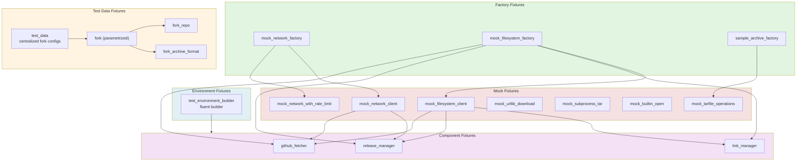

---

## 6. Test Pattern Catalog

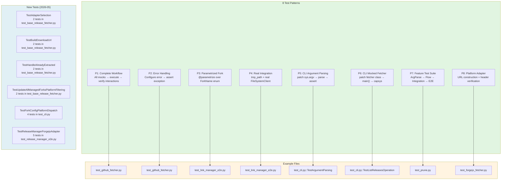

---

## 7. Golden Rules

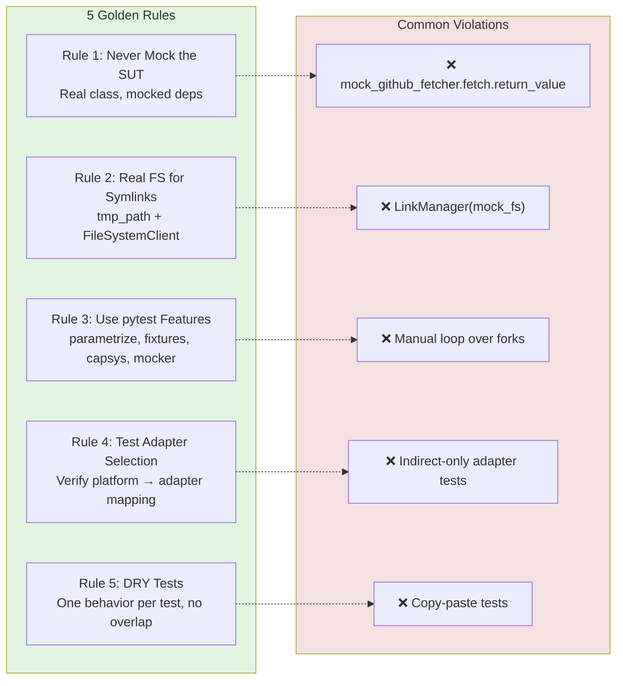

---

## 8. Feature Test Structure (New Feature Checklist)

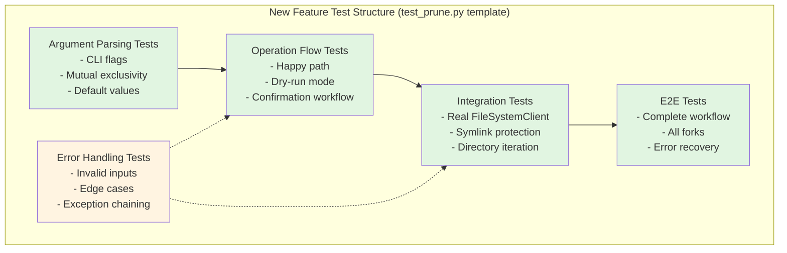

---

## 9. CLI Operation Test Coverage

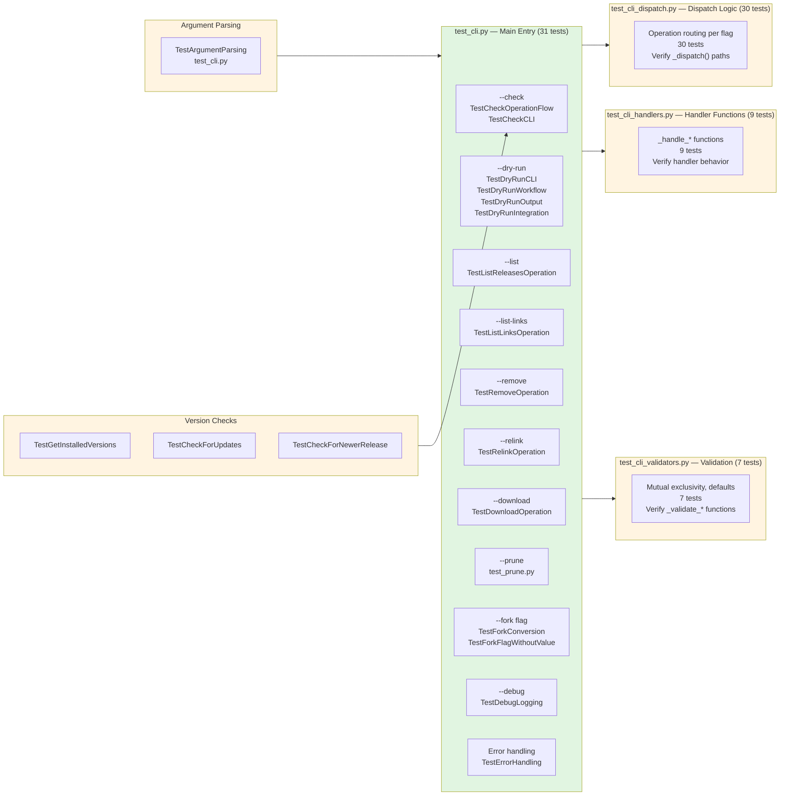

---

## 10. Test Execution Flow — What Happens When You Run `pytest`

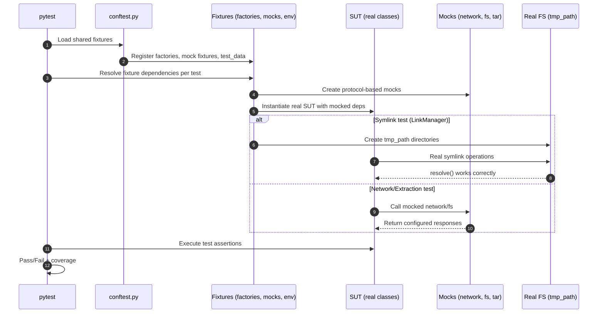

---

## 11. Adding a New Platform — Test Flow

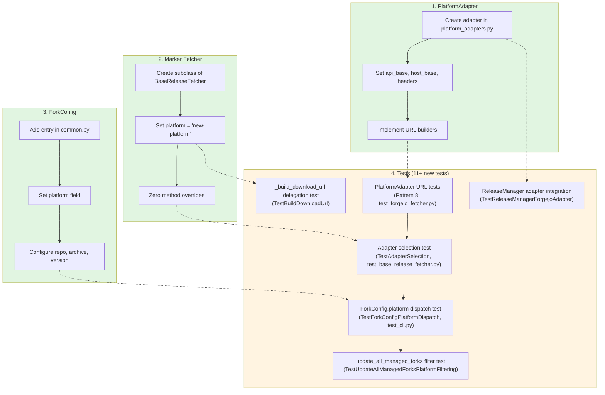

---

## 12. New Source Modules — Extracted from LinkManager

> LinkManager (~400 lines) was refactored into 5 focused modules. Each has its own test file.

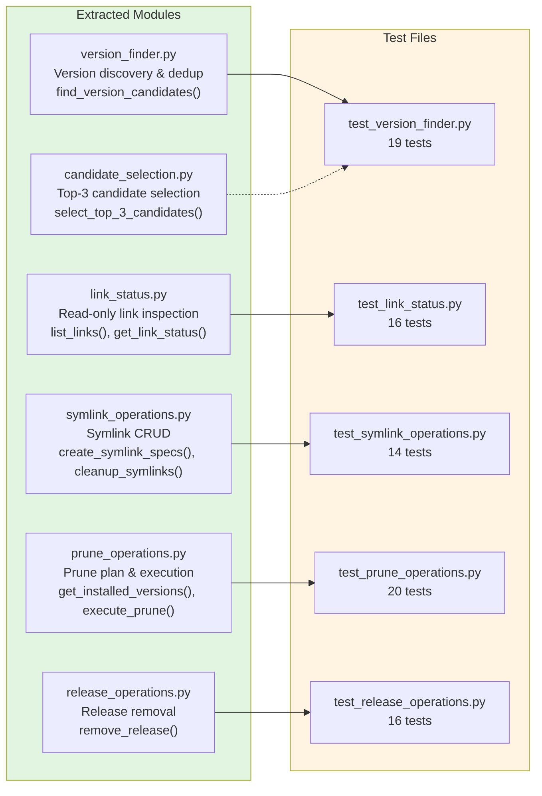

**Module responsibilities:**

| Module                   | Responsibility                                | Key Functions                                  |
| ------------------------ | --------------------------------------------- | ---------------------------------------------- |
| `version_finder.py`      | Scan directories, parse versions, deduplicate | `find_version_candidates()`                    |
| `candidate_selection.py` | Select top-3 candidates for symlinks          | `select_top_3_candidates()`                    |
| `link_status.py`         | Read-only link inspection                     | `list_links()`, `get_link_status()`            |
| `symlink_operations.py`  | Symlink CRUD (create, cleanup, manage)        | `create_symlink_specs()`, `cleanup_symlinks()` |
| `prune_operations.py`    | Prune plan computation & execution            | `get_installed_versions()`, `execute_prune()`  |
| `release_operations.py`  | Remove specific releases                      | `remove_release()`                             |

---

## 13. Coverage Strategy — What Gets Covered by What

```mermaid
graph TD
    subgraph E2E_COV["One E2E Test Covers 8+ Modules"]
        USER["User: 'fetch latest GE-Proton'"]
        CLI_MOD["cli.py — argument parsing"]
        FETCHER_MOD["github_fetcher.py — orchestrate()"]
        RELEASE_MOD["release_manager.py — find_asset()"]
        DOWNLOAD_MOD["asset_downloader.py — download()"]
        EXTRACT_MOD["archive_extractor.py — extract()"]
        VERSION_MOD["version_finder.py — discover versions"]
        CANDIDATE_MOD["candidate_selection.py — select top-3"]
        SYMLINK_MOD["symlink_operations.py — create symlinks"]
        LINK_STATUS_MOD["link_status.py — verify links"]
        RESULT["Symlinks created ✓"]
    end

    USER --> CLI_MOD --> FETCHER_MOD --> RELEASE_MOD --> DOWNLOAD_MOD --> EXTRACT_MOD --> VERSION_MOD --> CANDIDATE_MOD --> SYMLINK_MOD --> LINK_STATUS_MOD --> RESULT

    style E2E_COV fill:#e1f5e1
```

---

## 14. Test Suite Statistics & Quick Reference

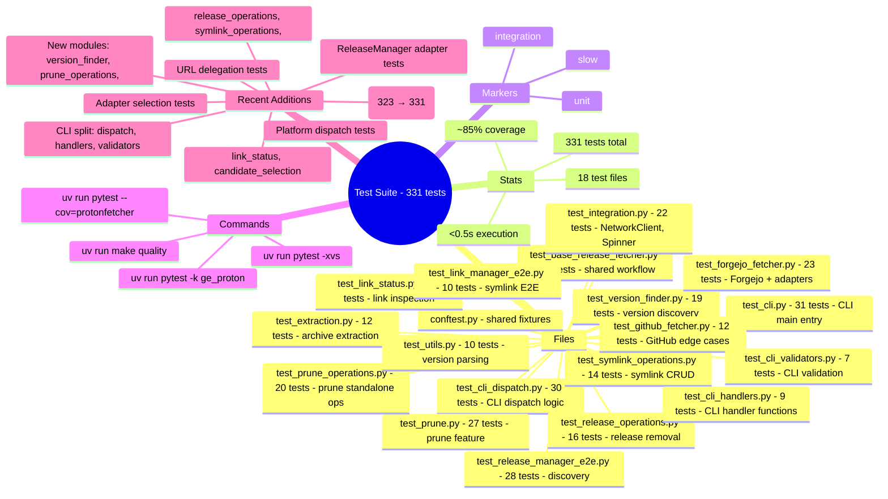

---

## 15. conftest.py Fixture Architecture

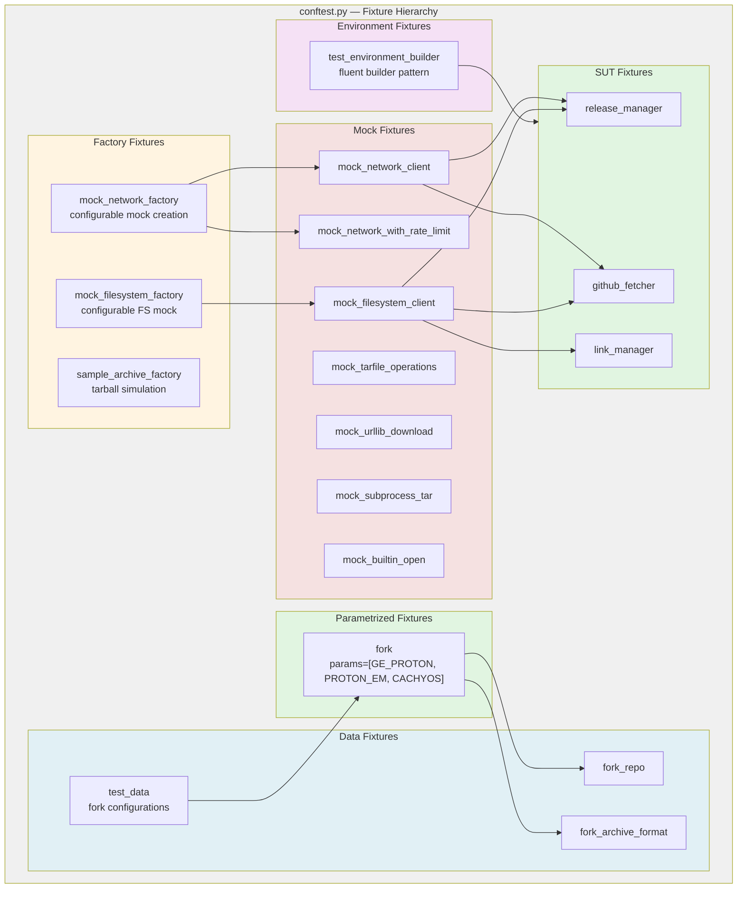

---

## 16. New Test Classes — 2026-05 Refinement

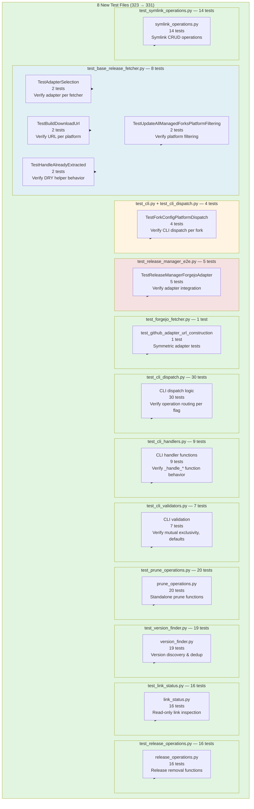

### Test Class Summary

| Class                                        | File                                   | Tests | Purpose                                                    |
| -------------------------------------------- | -------------------------------------- | ----- | ---------------------------------------------------------- |
| `TestAdapterSelection`                       | `test_base_release_fetcher.py`         | 2     | Verify `github_adapter` / `forgejo_adapter` selection      |
| `TestBuildDownloadUrl`                       | `test_base_release_fetcher.py`         | 2     | Verify `_build_download_url` delegates to adapter          |
| `TestHandleAlreadyExtracted`                 | `test_base_release_fetcher.py`         | 2     | Verify DRY helper: skip vs. update paths                   |
| `TestUpdateAllManagedForksPlatformFiltering` | `test_base_release_fetcher.py`         | 2     | Verify GitHub/Forgejo fork filtering                       |
| `TestForkConfigPlatformDispatch`             | `test_cli.py` + `test_cli_dispatch.py` | 4     | Verify CLI dispatches DW-Proton→Forgejo, others→GitHub     |
| `TestReleaseManagerForgejoAdapter`           | `test_release_manager_e2e.py`          | 5     | Verify adapter injection, URL construction, URL difference |
| `test_github_adapter_url_construction`       | `test_forgejo_fetcher.py`              | 1     | Symmetric to existing `forgejo_adapter` tests              |
| CLI dispatch logic                           | `test_cli_dispatch.py`                 | 30    | Verify operation routing per flag                          |
| CLI handler functions                        | `test_cli_handlers.py`                 | 9     | Verify `_handle_*` function behavior                       |
| CLI validation                               | `test_cli_validators.py`               | 7     | Verify mutual exclusivity, defaults                        |
| prune_operations.py                          | `test_prune_operations.py`             | 20    | Standalone prune functions                                 |
| version_finder.py                            | `test_version_finder.py`               | 19    | Version discovery & dedup                                  |
| link_status.py                               | `test_link_status.py`                  | 16    | Read-only link inspection                                  |
| release_operations.py                        | `test_release_operations.py`           | 16    | Release removal functions                                  |
| symlink_operations.py                        | `test_symlink_operations.py`           | 14    | Symlink CRUD operations                                    |
