# ProtonFetcher Test Suite — Code Navigation Map

> Mermaid-first reference. For fixture docs, see [`FIXTURES.md`](FIXTURES.md).

---

## 1. Test Priority Pyramid

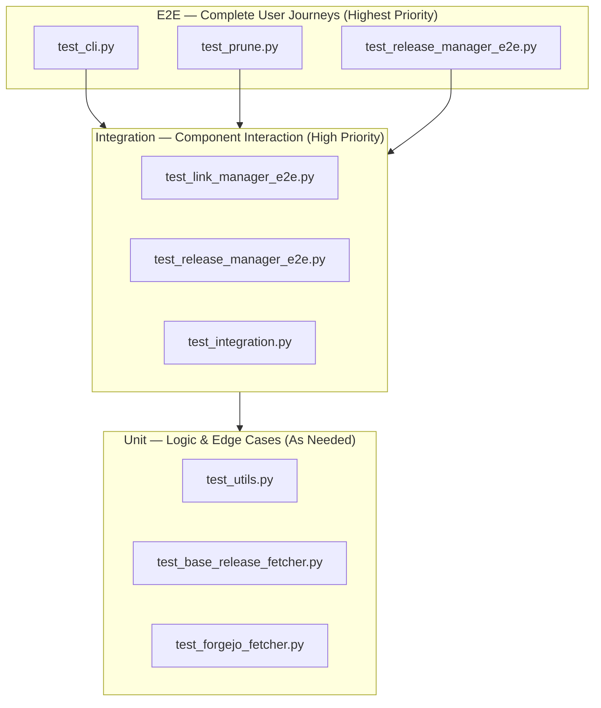
```mermaid
graph TD
    subgraph E2E["E2E — Complete User Journeys (Highest Priority)"]
        E2E_CLI["test_cli.py"]
        E2E_PRUNE["test_prune.py"]
        E2E_RELEASE["test_release_manager_e2e.py"]
    end

    subgraph INTEGRATION["Integration — Component Interaction (High Priority)"]
        INT_LINK["test_link_manager_e2e.py"]
        INT_RELEASE["test_release_manager_e2e.py"]
        INT_INTEGRATION["test_integration.py"]
    end

    subgraph UNIT["Unit — Logic & Edge Cases (As Needed)"]
        UT_UTILS["test_utils.py"]
        UT_BASE["test_base_release_fetcher.py"]
        UT_FORGEJO["test_forgejo_fetcher.py"]
    end

    E2E_CLI --> INTEGRATION
    E2E_PRUNE --> INTEGRATION
    E2E_RELEASE --> INTEGRATION
    INTEGRATION --> UNIT
```

---

## 2. Test File → Source Module Mapping

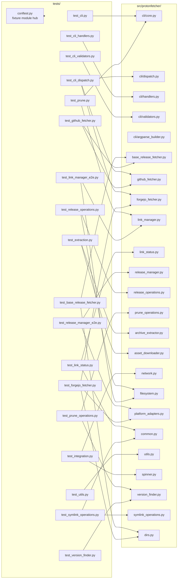
```mermaid
graph LR
    subgraph TESTS["tests/"]
        T_CLI["test_cli.py"]
        T_DISPATCH["test_cli_dispatch.py"]
        T_HANDLERS["test_cli_handlers.py"]
        T_VALIDATORS["test_cli_validators.py"]
        T_BASE["test_base_release_fetcher.py"]
        T_PRUNE["test_prune.py"]
        T_PRUNE_OPS["test_prune_operations.py"]
        T_VERSION["test_version_finder.py"]
        T_RELEASE_E2E["test_release_manager_e2e.py"]
        T_INTEGRATION["test_integration.py"]
        T_LINK_STATUS["test_link_status.py"]
        T_RELEASE_OPS["test_release_operations.py"]
        T_FORGEJO["test_forgejo_fetcher.py"]
        T_SYMLINK_OPS["test_symlink_operations.py"]
        T_GITHUB["test_github_fetcher.py"]
        T_EXTRACTION["test_extraction.py"]
        T_LINK_MGR["test_link_manager_e2e.py"]
        T_UTILS["test_utils.py"]
        C["conftest.py\nfixture module hub"]
    end

    subgraph SRC["src/protonfetcher/"]
        S_CLI_CORE["cli/core.py"]
        S_CLI_DISPATCH["cli/dispatch.py"]
        S_CLI_HANDLERS["cli/handlers.py"]
        S_CLI_VALIDATORS["cli/validators.py"]
        S_CLI_ARGPARSE["cli/argparse_builder.py"]
        S_FETCHER["base_release_fetcher.py"]
        S_GITHUB["github_fetcher.py"]
        S_FORGEJO["forgejo_fetcher.py"]
        S_LINK["link_manager.py"]
        S_LINK_STATUS["link_status.py"]
        S_RELEASE["release_manager.py"]
        S_RELEASE_OPS["release_operations.py"]
        S_PRUNE_OPS["prune_operations.py"]
        S_EXTRACTION["archive_extractor.py"]
        S_DOWNLOAD["asset_downloader.py"]
        S_NETWORK["network.py"]
        S_FS["filesystem.py"]
        S_ADAPTER["platform_adapters.py"]
        S_COMMON["common.py"]
        S_UTILS["utils.py"]
        S_SPINNER["spinner.py"]
        S_VERSION["version_finder.py"]
        S_SYMLINK_OPS["symlink_operations.py"]
        S_DIRS["dirs.py"]
    end

    T_CLI --> S_CLI_CORE
    T_DISPATCH --> S_CLI_DISPATCH
    T_DISPATCH --> S_GITHUB & S_FORGEJO
    T_HANDLERS --> S_CLI_HANDLERS
    T_VALIDATORS --> S_CLI_VALIDATORS
    T_BASE --> S_FETCHER & S_DIRS
    T_PRUNE --> S_LINK & S_CLI_CORE
    T_PRUNE_OPS --> S_PRUNE_OPS & S_VERSION
    T_LINK_STATUS --> S_LINK_STATUS & S_COMMON
    T_RELEASE_OPS --> S_RELEASE_OPS & S_FS
    T_RELEASE_E2E --> S_RELEASE & S_ADAPTER
    T_GITHUB --> S_GITHUB & S_FETCHER
    T_FORGEJO --> S_FORGEJO & S_ADAPTER & S_DIRS
    T_EXTRACTION --> S_EXTRACTION & S_DOWNLOAD
    T_INTEGRATION --> S_NETWORK & S_SPINNER
    T_UTILS --> S_UTILS
    T_VERSION --> S_VERSION
    T_SYMLINK_OPS --> S_SYMLINK_OPS & S_COMMON
    T_LINK_MGR --> S_LINK & S_FS
    C --> TESTS
```

---

## 3. Adapter-Based Architecture & Test Implications

```mermaid
classDiagram
    class BaseReleaseFetcher {
        +platform: str
        +release_manager: ReleaseManager
        +fetch_and_extract()
        +check_for_newer()
        +remove_release()
        +relink_fork()
        +update_all_managed_forks()
    }

    class GitHubReleaseFetcher {
        <<marker>>
        platform = "github"
    }

    class ForgejoReleaseFetcher {
        <<marker>>
        platform = "forgejo"
    }

    class PlatformAdapter {
        <<protocol>>
        +api_base: str
        +host_base: str
        +default_headers: dict
        +build_api_url()
        +build_download_url()
        +build_host_url()
    }

    class GitHubPlatformAdapter {
        api_base = "https://api.github.com"
    }

    class ForgejoPlatformAdapter {
        api_base = "https://dawn.wine/api/v1"
    }

    class ReleaseManager {
        +platform_adapter: PlatformAdapter
        +find_asset_by_name()
        +list_recent_releases()
    }

    class ForkConfig {
        +platform: str
        +repo: str
        +archive_format: str
        +version_pattern: str
    }

    BaseReleaseFetcher <|-- GitHubReleaseFetcher
    BaseReleaseFetcher <|-- ForgejoReleaseFetcher
    BaseReleaseFetcher o-- ReleaseManager
    ReleaseManager o-- PlatformAdapter
    PlatformAdapter <|.. GitHubPlatformAdapter
    PlatformAdapter <|.. ForgejoPlatformAdapter
    ForkConfig --> BaseReleaseFetcher : "platform field selects adapter"

    note for GitHubReleaseFetcher["~28 lines, zero overrides<br/>Test: adapter selection + URL delegation"]
    note for ForgejoReleaseFetcher["~28 lines, zero overrides<br/>Test: adapter selection + URL delegation"]
    note for BaseReleaseFetcher["~500 lines, ALL logic<br/>Test: test_base_release_fetcher.py"]
    note for PlatformAdapter["URL/header construction<br/>Test: test_forgejo_fetcher.py + test_release_manager_e2e.py (Pattern 8)"]
```

---

## 4. Mocking Strategy & Dependency Injection

```mermaid
graph TB
    subgraph SUT["System Under Test (REAL)"]
        FETCHER["BaseReleaseFetcher<br/>GitHubReleaseFetcher<br/>ForgejoReleaseFetcher"]
        LINK_MGR["LinkManager"]
        RELEASE_MGR["ReleaseManager"]
        EXTRACTOR["ArchiveExtractor"]
    end

    subgraph MOCKS["Mocks (Protocol-Based)"]
        NET_MOCK["mock_network_client<br/>NetworkClientProtocol"]
        FS_MOCK["mock_filesystem_client<br/>FileSystemClientProtocol"]
        TAR_MOCK["mock_tarfile_operations<br/>tarfile.open patch"]
        URL_MOCK["mock_urllib_download<br/>urllib.request.urlopen"]
        SUB_MOCK["mock_subprocess_tar<br/>subprocess.run"]
        OPEN_MOCK["mock_builtin_open<br/>builtins.open"]
    end

    subgraph REAL_FS["Real Filesystem (tmp_path)"]
        SYMLINK["Symlink creation/resolution"]
        DIR_ITER["Directory iteration"]
    end

    FETCHER --> NET_MOCK
    FETCHER --> FS_MOCK
    EXTRACTOR --> TAR_MOCK
    EXTRACTOR --> URL_MOCK
    EXTRACTOR --> SUB_MOCK
    EXTRACTOR --> OPEN_MOCK
    LINK_MGR --> REAL_FS
    RELEASE_MGR --> NET_MOCK

    note for MOCKS["Always mock: network, tarfile,<br/>file read/write, subprocess"]
    note for REAL_FS["Never mock: symlinks<br/>(resolve() breaks with mocks)"]
```

---

## 5. Fixture Dependency Graph

```mermaid
graph TD
    subgraph DATA["Data Fixtures (tests/data.py)"]
        TEST_DATA["test_data<br/>centralized fork configs"]
    end

    subgraph FACTORIES["Factory Fixtures (tests/factories.py)"]
        NET_FACTORY["mock_network_factory"]
        FS_FACTORY["mock_filesystem_factory"]
        ARCHIVE_FACTORY["sample_archive_factory"]
    end

    subgraph ENVIRONMENT["Environment Fixtures (tests/fixtures.py)"]
        TEMP_ENV["temp_environment"]
        EXTRACT_DIR["extract_dir"]
        INSTALLED["installed_proton_versions"]
        SYMLINK_ENV["symlink_environment"]
    end

    subgraph FORK_PARAM["Fork Parametrization (tests/fixtures.py)"]
        FORK_FIXTURE["fork (parametrized)"]
    end

    subgraph COMPONENTS["Component Fixtures (tests/fixtures.py)"]
        LM_FIXTURE["link_manager"]
    end

    subgraph MOCKS["Mock Fixtures (tests/fixtures.py)"]
        NET_CLIENT["mock_network_client"]
        FS_CLIENT["mock_filesystem_client"]
        TAR_OPS["mock_tarfile_operations"]
        URL_DL["mock_urllib_download"]
        SUB_TAR["mock_subprocess_tar"]
        BUILTIN_OPEN["mock_builtin_open"]
        TAR_GZ["sample_tar_gz_archive"]
        TAR_XZ["sample_tar_xz_archive"]
    end

    NET_FACTORY --> NET_CLIENT
    FS_FACTORY --> FS_CLIENT
    FS_FACTORY --> LM_FIXTURE
    ARCHIVE_FACTORY --> TAR_GZ
    ARCHIVE_FACTORY --> TAR_XZ

    FORK_FIXTURE --> INSTALLED
    FORK_FIXTURE --> SYMLINK_ENV
    TEST_DATA --> FORK_FIXTURE

    NET_CLIENT --> LM_FIXTURE

    style FACTORIES fill:#e1f5e1
    style ENVIRONMENT fill:#e1f0f5
    style DATA fill:#fff4e1
    style FORK_PARAM fill:#fff4e1
    style COMPONENTS fill:#f5e1f5
    style MOCKS fill:#f5e1e1
```

---

## 6. Test Pattern Catalog

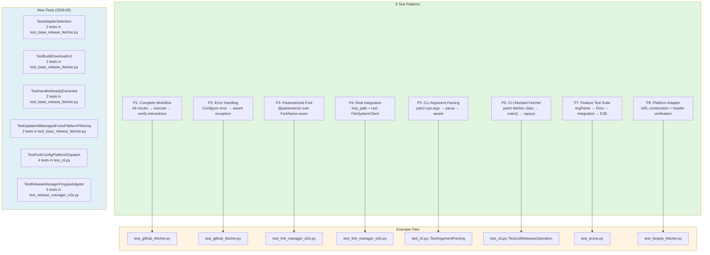
```mermaid
graph TB
    subgraph PATTERNS["8 Test Patterns"]
        P1["P1: Complete Workflow<br/>All mocks → execute → verify interactions"]
        P2["P2: Error Handling<br/>Configure error → assert exception"]
        P3["P3: Parametrized Fork<br/>@parametrize over ForkName enum"]
        P4["P4: Real Integration<br/>tmp_path + real FileSystemClient"]
        P5["P5: CLI Argument Parsing<br/>patch sys.argv → parse → assert"]
        P6["P6: CLI Mocked Fetcher<br/>patch fetcher class → main() → capsys"]
        P7["P7: Feature Test Suite<br/>ArgParse → Flow → Integration → E2E"]
        P8["P8: Platform Adapter<br/>URL construction + header verification"]
    end

    subgraph EXAMPLES["Example Files"]
        E1["test_github_fetcher.py"]
        E2["test_github_fetcher.py"]
        E3["test_link_manager_e2e.py"]
        E4["test_link_manager_e2e.py"]
        E5["test_cli.py::TestArgumentParsing"]
        E6["test_cli.py::TestListReleasesOperation"]
        E7["test_prune.py"]
        E8["test_forgejo_fetcher.py"]
    end

    subgraph NEW_TESTS["New Tests (2026-05)"]
        NT1["TestAdapterSelection<br/>2 tests in test_base_release_fetcher.py"]
        NT2["TestBuildDownloadUrl<br/>2 tests in test_base_release_fetcher.py"]
        NT3["TestHandleAlreadyExtracted<br/>2 tests in test_base_release_fetcher.py"]
        NT4["TestUpdateAllManagedForksPlatformFiltering<br/>2 tests in test_base_release_fetcher.py"]
        NT5["TestForkConfigPlatformDispatch<br/>4 tests in test_cli.py"]
        NT6["TestReleaseManagerForgejoAdapter<br/>5 tests in test_release_manager_e2e.py"]
    end

    P1 --> E1
    P2 --> E2
    P3 --> E3
    P4 --> E4
    P5 --> E5
    P6 --> E6
    P7 --> E7
    P8 --> E8

    style PATTERNS fill:#e1f5e1
    style EXAMPLES fill:#fff4e1
    style NEW_TESTS fill:#e1f0f5
```

---

## 7. Golden Rules

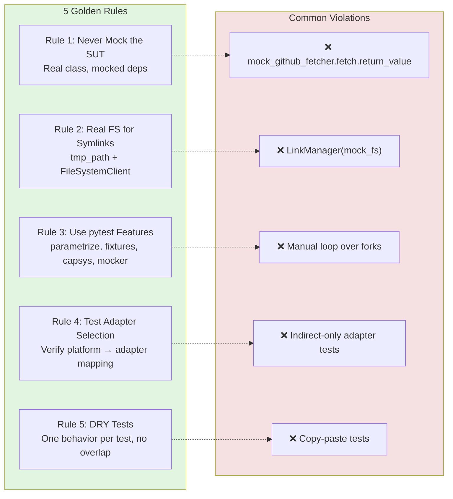
```mermaid
graph LR
    subgraph RULES["5 Golden Rules"]
        R1["Rule 1: Never Mock the SUT<br/>Real class, mocked deps"]
        R2["Rule 2: Real FS for Symlinks<br/>tmp_path + FileSystemClient"]
        R3["Rule 3: Use pytest Features<br/>parametrize, fixtures, capsys, mocker"]
        R4["Rule 4: Test Adapter Selection<br/>Verify platform → adapter mapping"]
        R5["Rule 5: DRY Tests<br/>One behavior per test, no overlap"]
    end

    subgraph VIOLATIONS["Common Violations"]
        V1["❌ mock_github_fetcher.fetch.return_value"]
        V2["❌ LinkManager(mock_fs)"]
        V3["❌ Manual loop over forks"]
        V4["❌ Indirect-only adapter tests"]
        V5["❌ Copy-paste tests"]
    end

    R1 -.-> V1
    R2 -.-> V2
    R3 -.-> V3
    R4 -.-> V4
    R5 -.-> V5

    style RULES fill:#e1f5e1
    style VIOLATIONS fill:#f5e1e1
```

---

## 8. Feature Test Structure (New Feature Checklist)

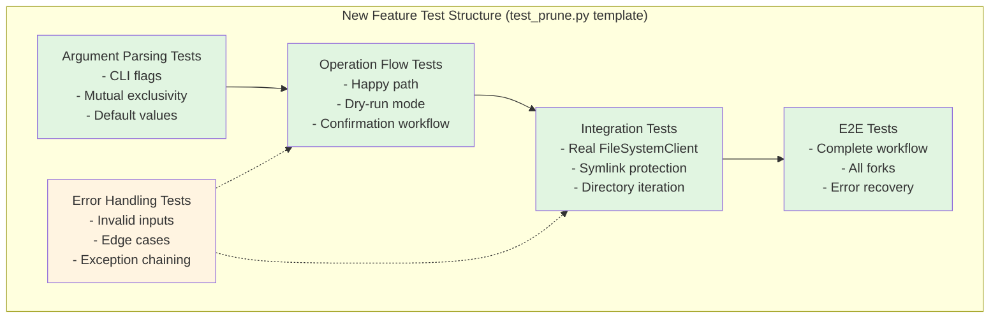
```mermaid
graph TD
    subgraph FEATURE["New Feature Test Structure (test_prune.py template)"]
        A["Argument Parsing Tests<br/>- CLI flags<br/>- Mutual exclusivity<br/>- Default values"]
        B["Operation Flow Tests<br/>- Happy path<br/>- Dry-run mode<br/>- Confirmation workflow"]
        C["Integration Tests<br/>- Real FileSystemClient<br/>- Symlink protection<br/>- Directory iteration"]
        D["E2E Tests<br/>- Complete workflow<br/>- All forks<br/>- Error recovery"]
        E["Error Handling Tests<br/>- Invalid inputs<br/>- Edge cases<br/>- Exception chaining"]
    end

    A --> B --> C --> D
    E -.-> B
    E -.-> C

    style A fill:#e1f5e1
    style B fill:#e1f5e1
    style C fill:#e1f5e1
    style D fill:#e1f5e1
    style E fill:#fff4e1
```

---

## 9. CLI Operation Test Coverage

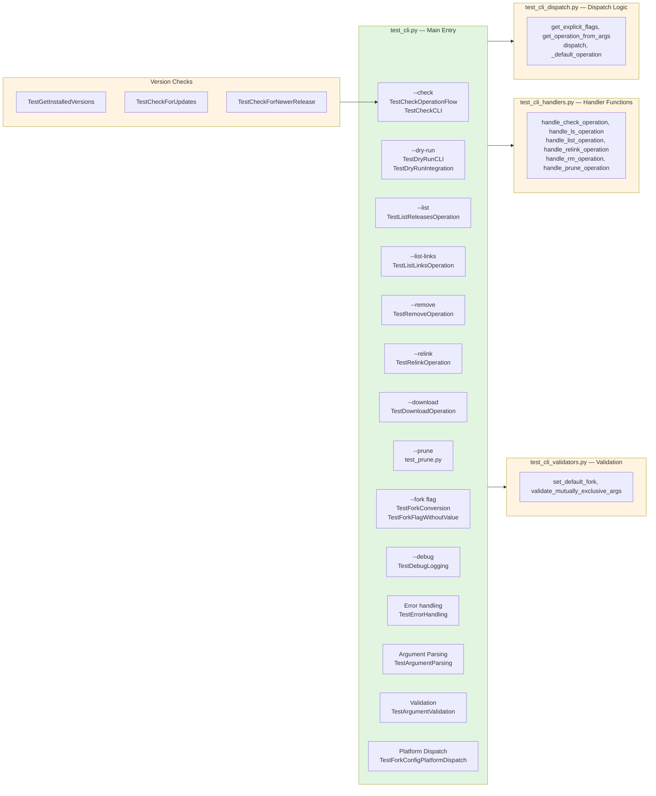
```mermaid
graph LR
    subgraph CLI_MAIN["test_cli.py — Main Entry"]
        OP_CHECK["--check<br/>TestCheckOperationFlow<br/>TestCheckCLI"]
        OP_DRYRUN["--dry-run<br/>TestDryRunCLI<br/>TestDryRunIntegration"]
        OP_LIST["--list<br/>TestListReleasesOperation"]
        OP_LINKS["--list-links<br/>TestListLinksOperation"]
        OP_REMOVE["--remove<br/>TestRemoveOperation"]
        OP_RELINK["--relink<br/>TestRelinkOperation"]
        OP_DOWNLOAD["--download<br/>TestDownloadOperation"]
        OP_PRUNE["--prune<br/>test_prune.py"]
        OP_FORK["--fork flag<br/>TestForkConversion<br/>TestForkFlagWithoutValue"]
        OP_DEBUG["--debug<br/>TestDebugLogging"]
        OP_ERROR["Error handling<br/>TestErrorHandling"]
        OP_PARSE["Argument Parsing<br/>TestArgumentParsing"]
        OP_VALID["Validation<br/>TestArgumentValidation"]
        OP_PLATFORM["Platform Dispatch<br/>TestForkConfigPlatformDispatch"]
    end

    subgraph CLI_DISPATCH["test_cli_dispatch.py — Dispatch Logic"]
        DD["get_explicit_flags, get_operation_from_args<br/>dispatch, _default_operation"]
    end

    subgraph CLI_HANDLERS["test_cli_handlers.py — Handler Functions"]
        DH["handle_check_operation, handle_ls_operation<br/>handle_list_operation, handle_relink_operation<br/>handle_rm_operation, handle_prune_operation"]
    end

    subgraph CLI_VALIDATORS["test_cli_validators.py — Validation"]
        DV["set_default_fork, validate_mutually_exclusive_args"]
    end

    subgraph VERSIONS["Version Checks"]
        INSTALLED["TestGetInstalledVersions"]
        UPDATES["TestCheckForUpdates"]
        NEWER["TestCheckForNewerRelease"]
    end

    CLI_MAIN --> CLI_DISPATCH
    CLI_MAIN --> CLI_HANDLERS
    CLI_MAIN --> CLI_VALIDATORS
    VERSIONS --> OP_CHECK

    style CLI_MAIN fill:#e1f5e1
    style CLI_DISPATCH fill:#fff4e1
    style CLI_HANDLERS fill:#fff4e1
    style CLI_VALIDATORS fill:#fff4e1
    style VERSIONS fill:#fff4e1
```

---

## 10. Test Execution Flow — What Happens When You Run `pytest`

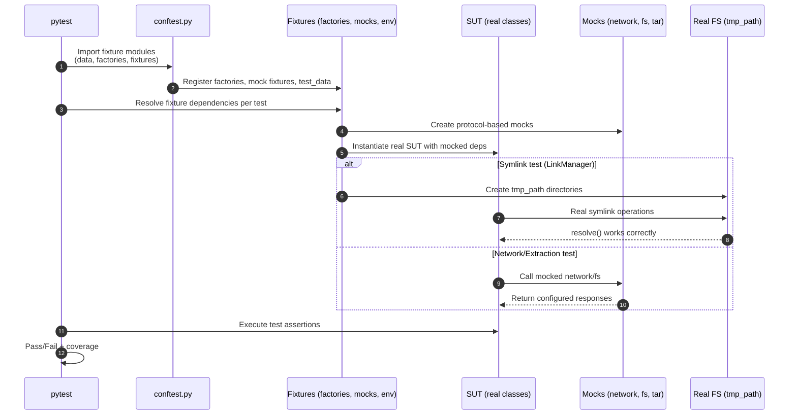
```mermaid
sequenceDiagram
    autonumber
    participant PY as pytest
    participant CF as conftest.py
    participant FIX as Fixtures (factories, mocks, env)
    participant SUT as SUT (real classes)
    participant MOCK as Mocks (network, fs, tar)
    participant FS as Real FS (tmp_path)

    PY->>CF: Import fixture modules<br/>(data, factories, fixtures)
    CF->>FIX: Register factories, mock fixtures, test_data
    PY->>FIX: Resolve fixture dependencies per test
    FIX->>MOCK: Create protocol-based mocks
    FIX->>SUT: Instantiate real SUT with mocked deps

    alt Symlink test (LinkManager)
        FIX->>FS: Create tmp_path directories
        SUT->>FS: Real symlink operations
        FS-->>SUT: resolve() works correctly
    else Network/Extraction test
        SUT->>MOCK: Call mocked network/fs
        MOCK-->>SUT: Return configured responses
    end

    PY->>SUT: Execute test assertions
    PY->>PY: Pass/Fail + coverage
```

---

## 11. Adding a New Platform — Test Flow

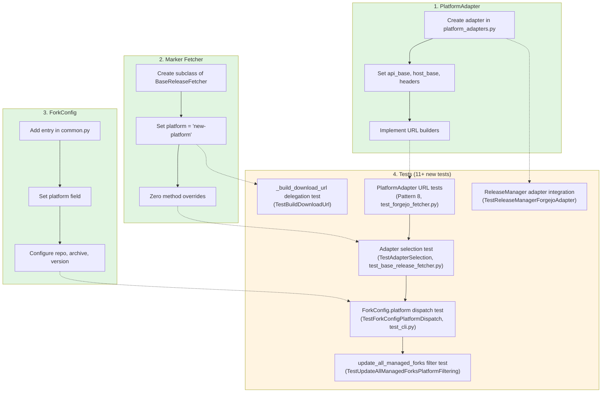
```mermaid
graph TD
    subgraph STEP1["1. PlatformAdapter"]
        A1["Create adapter in platform_adapters.py"]
        A2["Set api_base, host_base, headers"]
        A3["Implement URL builders"]
    end

    subgraph STEP2["2. Marker Fetcher"]
        B1["Create subclass of BaseReleaseFetcher"]
        B2["Set platform = 'new-platform'"]
        B3["Zero method overrides"]
    end

    subgraph STEP3["3. ForkConfig"]
        C1["Add entry in common.py"]
        C2["Set platform field"]
        C3["Configure repo, archive, version"]
    end

    subgraph STEP4["4. Tests (11+ new tests)"]
        D1["PlatformAdapter URL tests<br/>(Pattern 8, test_forgejo_fetcher.py)"]
        D2["Adapter selection test<br/>(TestAdapterSelection, test_base_release_fetcher.py)"]
        D3["ForkConfig.platform dispatch test<br/>(TestForkConfigPlatformDispatch, test_cli.py)"]
        D4["update_all_managed_forks filter test<br/>(TestUpdateAllManagedForksPlatformFiltering)"]
        D5["_build_download_url delegation test<br/>(TestBuildDownloadUrl)"]
        D6["ReleaseManager adapter integration<br/>(TestReleaseManagerForgejoAdapter)"]
    end

    A1 --> A2 --> A3
    B1 --> B2 --> B3
    C1 --> C2 --> C3
    D1 --> D2 --> D3 --> D4

    A3 -.-> D1
    B3 -.-> D2
    C3 -.-> D3
    B2 -.-> D5
    A1 -.-> D6

    style STEP1 fill:#e1f5e1
    style STEP2 fill:#e1f5e1
    style STEP3 fill:#e1f5e1
    style STEP4 fill:#fff4e1
```

---

## 12. New Source Modules — Extracted from LinkManager

> LinkManager (~355 lines) was refactored into 6 focused modules. Each has its own test file.

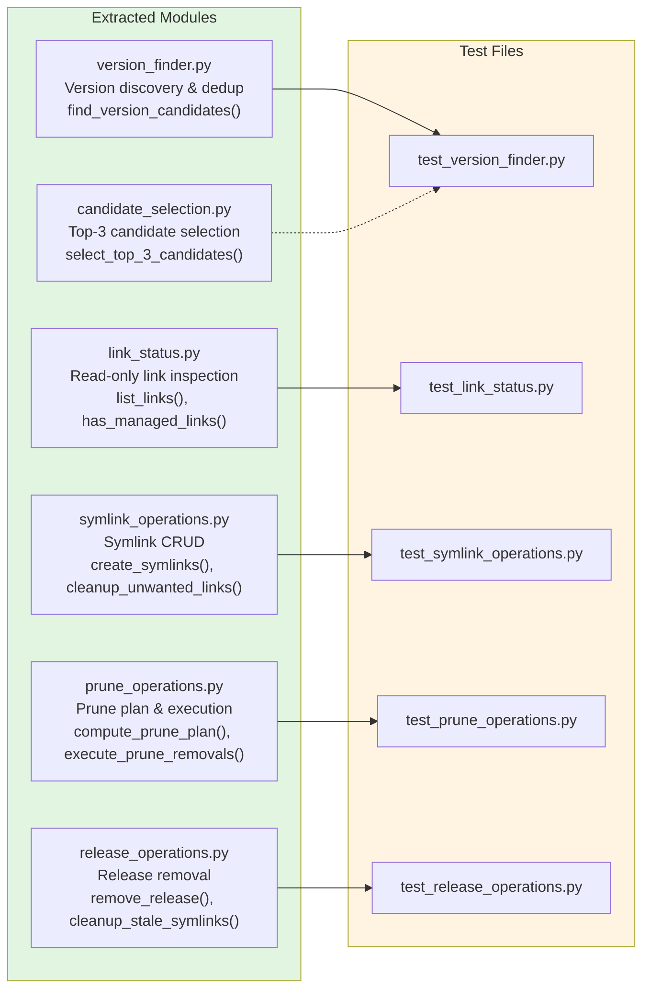
```mermaid
graph LR
    subgraph EXTRACTED["Extracted Modules"]
        VF["version_finder.py<br/>Version discovery & dedup<br/>find_version_candidates()"]
        CS["candidate_selection.py<br/>Top-3 candidate selection<br/>select_top_3_candidates()"]
        LS["link_status.py<br/>Read-only link inspection<br/>list_links(), has_managed_links()"]
        SO["symlink_operations.py<br/>Symlink CRUD<br/>create_symlinks(), cleanup_unwanted_links()"]
        PO["prune_operations.py<br/>Prune plan & execution<br/>compute_prune_plan(), execute_prune_removals()"]
        RO["release_operations.py<br/>Release removal<br/>remove_release(), cleanup_stale_symlinks()"]
    end

    subgraph TESTS["Test Files"]
        TVF["test_version_finder.py"]
        TLS["test_link_status.py"]
        TSO["test_symlink_operations.py"]
        TPO["test_prune_operations.py"]
        TRO["test_release_operations.py"]
    end

    VF --> TVF
    CS -.-> TVF
    LS --> TLS
    SO --> TSO
    PO --> TPO
    RO --> TRO

    style EXTRACTED fill:#e1f5e1
    style TESTS fill:#fff4e1
```

**Module responsibilities:**

| Module                   | Responsibility                                | Key Functions                                                                  |
| ------------------------ | --------------------------------------------- | ------------------------------------------------------------------------------ |
| `version_finder.py`      | Scan directories, parse versions, deduplicate | `find_version_candidates()`, `_deduplicate_candidates()`                        |
| `candidate_selection.py` | Select top-3 candidates for symlinks          | `select_top_3_candidates()`                                                     |
| `link_status.py`         | Read-only link inspection                     | `list_links()`, `has_managed_links()`, `get_installed_versions()`, `get_linked_versions()` |
| `symlink_operations.py`  | Symlink CRUD (create, cleanup, manage)        | `create_symlinks()`, `create_symlink_specs()`, `cleanup_unwanted_links()`      |
| `prune_operations.py`    | Prune plan computation & execution            | `compute_prune_plan()`, `execute_prune_removals()`, `prune_releases()`          |
| `release_operations.py`  | Remove specific releases                      | `remove_release()`, `cleanup_stale_symlinks()`                                 |

---

## 13. Coverage Strategy — What Gets Covered by What

```mermaid
graph TD
    subgraph E2E_COV["One E2E Test Covers 10+ Modules"]
        USER["User: 'fetch latest GE-Proton'"]
        CLI_MOD["cli/core.py — entry + parsing"]
        DISPATCH_MOD["cli/dispatch.py — routing"]
        HANDLER_MOD["cli/handlers.py — operation handlers"]
        FETCHER_MOD["github_fetcher.py — orchestrate()"]
        RELEASE_MOD["release_manager.py — find_asset_by_name()"]
        DOWNLOAD_MOD["asset_downloader.py — download()"]
        EXTRACT_MOD["archive_extractor.py — extract()"]
        VERSION_MOD["version_finder.py — discover versions"]
        CANDIDATE_MOD["candidate_selection.py — select top-3"]
        SYMLINK_MOD["symlink_operations.py — create symlinks"]
        LINK_STATUS_MOD["link_status.py — verify links"]
        RESULT["Symlinks created ✓"]
    end

    USER --> CLI_MOD --> DISPATCH_MOD --> HANDLER_MOD --> FETCHER_MOD --> RELEASE_MOD --> DOWNLOAD_MOD --> EXTRACT_MOD --> VERSION_MOD --> CANDIDATE_MOD --> SYMLINK_MOD --> LINK_STATUS_MOD --> RESULT

    style E2E_COV fill:#e1f5e1
```

---

## 14. Test Suite Statistics & Quick Reference

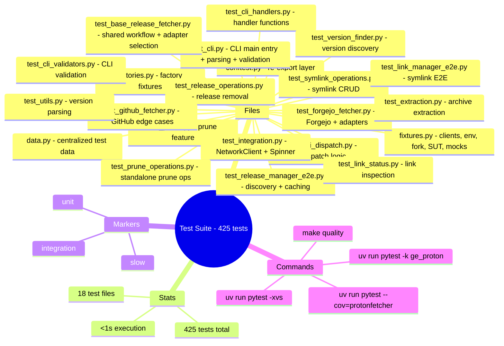
```mermaid
mindmap
    root((Test Suite - 425 tests))
        Files
            conftest.py - re-export layer
            data.py - centralized test data
            factories.py - factory fixtures
            fixtures.py - clients, env, fork, SUT, mocks
            test_cli.py - CLI main entry + parsing + validation
            test_cli_dispatch.py - dispatch logic
            test_cli_handlers.py - handler functions
            test_cli_validators.py - CLI validation
            test_base_release_fetcher.py - shared workflow + adapter selection
            test_prune.py - prune feature
            test_release_manager_e2e.py - discovery + caching
            test_integration.py - NetworkClient + Spinner
            test_prune_operations.py - standalone prune ops
            test_version_finder.py - version discovery
            test_link_status.py - link inspection
            test_release_operations.py - release removal
            test_forgejo_fetcher.py - Forgejo + adapters
            test_symlink_operations.py - symlink CRUD
            test_github_fetcher.py - GitHub edge cases
            test_extraction.py - archive extraction
            test_link_manager_e2e.py - symlink E2E
            test_utils.py - version parsing
        Stats
            18 test files
            425 tests total
            <1s execution
        Markers
            integration
            unit
            slow
        Commands
            uv run pytest -xvs
            uv run pytest -k ge_proton
            uv run pytest --cov=protonfetcher
            make quality
```

---

## 15. Fixture Module Architecture

Fixture code is split into three modules re-exported by `tests/conftest.py` (a thin import layer that also sets up `sys.path`).

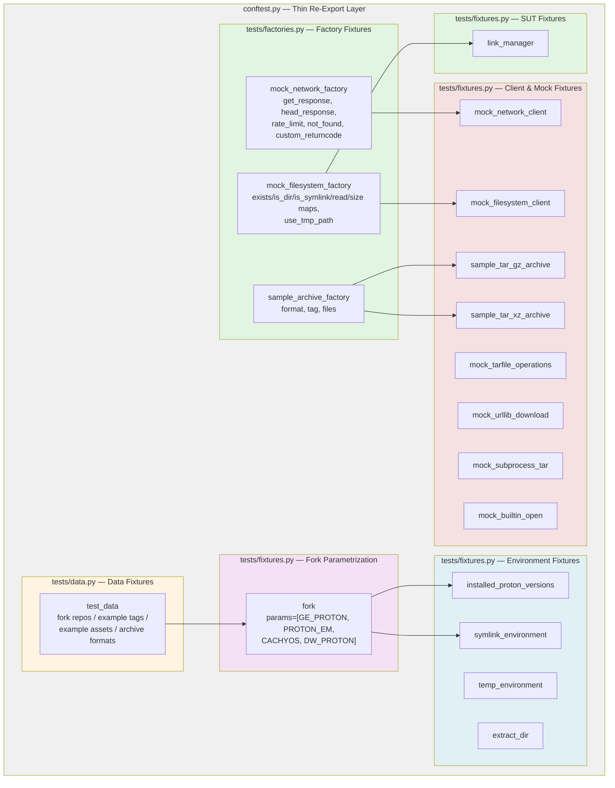
```mermaid
graph TD
    subgraph ROOT["conftest.py — Thin Re-Export Layer"]
        subgraph DATA_FIXTURES["tests/data.py — Data Fixtures"]
            TDATA["test_data<br/>fork repos / example tags /<br/>example assets / archive formats"]
        end

        subgraph FACTORY_FIXTURES["tests/factories.py — Factory Fixtures"]
            NET_FACT["mock_network_factory<br/>get_response, head_response,<br/>rate_limit, not_found, custom_returncode"]
            FS_FACT["mock_filesystem_factory<br/>exists/is_dir/is_symlink/read/size maps,<br/>use_tmp_path"]
            ARCH_FACT["sample_archive_factory<br/>format, tag, files"]
        end

        subgraph MOCK_FIXTURES["tests/fixtures.py — Client & Mock Fixtures"]
            MC_NET["mock_network_client"]
            MC_FS["mock_filesystem_client"]
            MC_TARGZ["sample_tar_gz_archive"]
            MC_TARXZ["sample_tar_xz_archive"]
            MC_TAR["mock_tarfile_operations"]
            MC_URL["mock_urllib_download"]
            MC_SUB["mock_subprocess_tar"]
            MC_OPEN["mock_builtin_open"]
        end

        subgraph ENV_FIXTURES["tests/fixtures.py — Environment Fixtures"]
            ENV_TEMP["temp_environment"]
            ENV_EXTRACT["extract_dir"]
            ENV_INSTALLED["installed_proton_versions"]
            ENV_SYMLINK["symlink_environment"]
        end

        subgraph FORK_PARAM["tests/fixtures.py — Fork Parametrization"]
            FORK["fork<br/>params=[GE_PROTON, PROTON_EM,<br/>CACHYOS, DW_PROTON]"]
        end

        subgraph SUT_FIXTURES["tests/fixtures.py — SUT Fixtures"]
            LMGR["link_manager"]
        end

        NET_FACT --> MC_NET
        FS_FACT --> MC_FS
        FS_FACT --> LMGR
        ARCH_FACT --> MC_TARGZ
        ARCH_FACT --> MC_TARXZ

        FORK --> ENV_INSTALLED
        FORK --> ENV_SYMLINK
        TDATA --> FORK
    end

    style ROOT fill:#f0f0f0
    style DATA_FIXTURES fill:#fff4e1
    style FACTORY_FIXTURES fill:#e1f5e1
    style MOCK_FIXTURES fill:#f5e1e1
    style ENV_FIXTURES fill:#e1f0f5
    style FORK_PARAM fill:#f5e1f5
    style SUT_FIXTURES fill:#e1f5e1
```

---

## 16. Test Classes — CLI Split & Extracted Modules

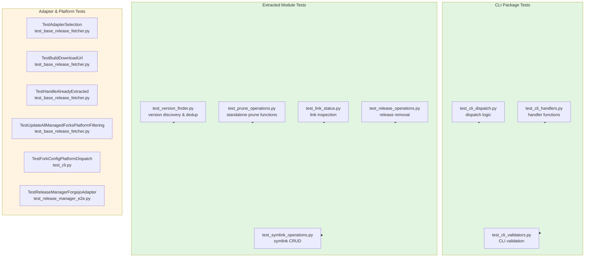
```mermaid
graph TB
    subgraph CLI_SPLIT["CLI Package Tests"]
        CD["test_cli_dispatch.py<br/>dispatch logic"]
        CH["test_cli_handlers.py<br/>handler functions"]
        CV["test_cli_validators.py<br/>CLI validation"]
    end

    subgraph EXTRACTED_TESTS["Extracted Module Tests"]
        TVF["test_version_finder.py<br/>version discovery & dedup"]
        TPO["test_prune_operations.py<br/>standalone prune functions"]
        TLS["test_link_status.py<br/>link inspection"]
        TRO["test_release_operations.py<br/>release removal"]
        TSO["test_symlink_operations.py<br/>symlink CRUD"]
    end

    subgraph ADAPTER_TESTS["Adapter & Platform Tests"]
        AT["TestAdapterSelection<br/>test_base_release_fetcher.py"]
        BD["TestBuildDownloadUrl<br/>test_base_release_fetcher.py"]
        HA["TestHandleAlreadyExtracted<br/>test_base_release_fetcher.py"]
        UF["TestUpdateAllManagedForksPlatformFiltering<br/>test_base_release_fetcher.py"]
        FD["TestForkConfigPlatformDispatch<br/>test_cli.py"]
        RA["TestReleaseManagerForgejoAdapter<br/>test_release_manager_e2e.py"]
    end

    CD --> CLI_SPLIT
    CH --> CLI_SPLIT
    CV --> CLI_SPLIT
    TVF --> EXTRACTED_TESTS
    TPO --> EXTRACTED_TESTS
    TLS --> EXTRACTED_TESTS
    TRO --> EXTRACTED_TESTS
    TSO --> EXTRACTED_TESTS

    style CLI_SPLIT fill:#e1f5e1
    style EXTRACTED_TESTS fill:#e1f5e1
    style ADAPTER_TESTS fill:#fff4e1
```
